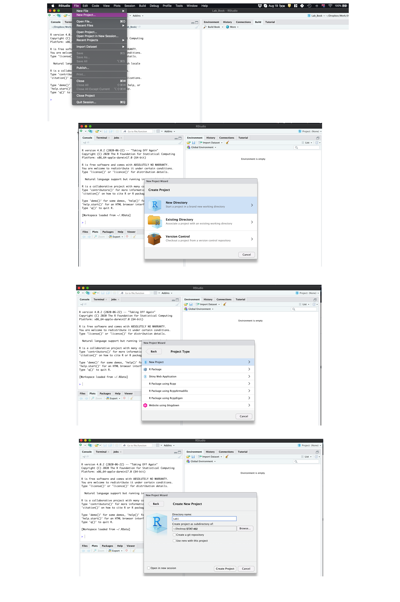
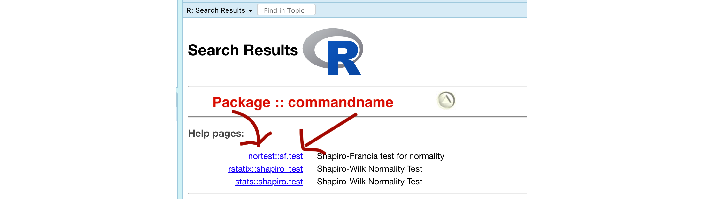
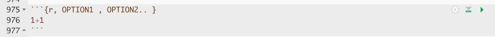
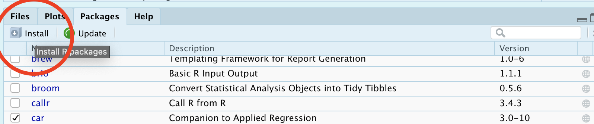

--- 
title: "STAT-462 Lab book"
author: "Helen Greatrex"
date: "`r Sys.Date()`"
site: bookdown::bookdown_site
documentclass: book
bibliography: [book.bib, packages.bib]
biblio-style: apalike
link-citations: yes
description: "Lab Book for STAT-462 2021"
---

# Tutorials

```{r, echo=FALSE,message=FALSE,warning=FALSE}

library("tidyverse") # Lots of data processing commands
library("knitr")     # Helps make good output files
library("rmarkdown") # Helps make good output files
library("lattice")   # Makes nice plots
library("RColorBrewer") # Makes nice color-scales
library("ISLR")      # contains a credit dataset
library("yarrr")     # contains a toy dataset about pirates
library("skimr")     # Summary statistics
library("Stat2Data") # Regression specific commands
library("olsrr")     # Regression specific commands
library("nortest")   # Regression specific commands
library("lmtest")    # Regression specific commands
library("IMTest")    # Regression specific commands 
library("MASS")      # Regression specific commands
#library("moderndive")# Regression specific commands
library("corrplot")  # correlation plots
library("car")       # this one sometimes has problems, don't panic if you get errors
library("ggpubr")    # QQplots
library("equatiomatic")

```

## Tutorial 1A: Installing R and R-studio

In this class, we would like you to download and install BOTH R and R-Studio onto your own computers.  You should have already completed this step for Homework 1.  If you have not, see instructions here: https://psu.instructure.com/courses/2115020/assignments/12682456 

FOR WINDOWS USERS.  Sometimes R asks you to download something called RTools.  You can do so here: https://cran.r-project.org/bin/windows/Rtools/  Follow the instructions closely and ask if you need support.


### Open R-studio

```{r, rrstudiot, echo=FALSE, fig.cap = "Icons of the R program and R-studio"}
knitr::include_graphics('images/Fig_01_01RRStudio.png')
```

**Open R-studio** (NOT R!).  You should be greeted by three panels:

 - The interactive R console (entire left)
 - Environment/History (tabbed in upper right)
 - Files/Plots/Packages/Help/Viewer (tabbed in lower right)

If you click on the View/Panes/Pane Layout menu item, you can move these quadrants around.  I tend to like the console to be top left and scripts to be top right, with the plots and environment on the bottom - but this is totally personal choice. 
 
```{r, basicStudiot, echo=FALSE, fig.cap = "The basic R-studio screen when you log on"}
knitr::include_graphics('images/Fig_01_02RStudio.png')
```

If you wish to learn more about what these windows do, have a look at this resource, from the Pirates Guide to R: https://bookdown.org/ndphillips/YaRrr/the-four-rstudio-windows.html

**If you have used R before, you might see that there are variables and plots etc already loaded**.  It is always good to clear these before you start a new analysis.  To do this, click the little broom symbol in your environment tab.

### Change a few settings

R-studio wants to be helpful and will try to re-load exactly where you were in a project when you log back in.  This can get really confusing, so we are going to turn this off.

ON A MAC: Click on the R-studio menu button on the top left of the screen, then click Preferences. 

ON A PC: Click on Tools-> Global Options -> Preferences

Now:

 - UNCLICK "Restore most recently opened project at startup"
 - Set "Save workspace to .RData on" exit to Never

## Tutorial 1B: Creating and loading R projects

### What are projects?

[](https://www.linkedin.com/learning/learning-the-r-tidyverse/why-should-you-use-projects-in-rstudio?u=76811570 "Why use R Projects")

One of the most useful new features in RStudio are R-Projects.  We are going to use R-projects to store our lab data in.  An R project is a place to store all your commands, data and output in the same place.  

Before R projects, we had to worry about where on your computer your data was saved in.  Now, we can force R-Studio to immediately look inside your lab folder - making life much easier. 

Equally, projects allow you to have multiple versions of R-studio open.  This is  useful because say you have Lab-2 open, but want to re-open Lab-1 to check some code, clicking the "Lab 1 project file" will load a whole new version of R with Lab 1 ready to edit.  

It is ***really*** important that you stay organized in this course, for example making sure you know where you put your data and your labs. 

**To encourage this, choose a place that makes sense on your computer, create a folder called STAT-462. can either do this outside R studio in your file explorer, or inside the "Files tab" in R studio.  You should store all your 462 labs inside this folder**

Now we will create our first project (also see the pic):  

 - open R-Studio and click `New Project`, 
 - then click "new directory" 
 - then "new project". 
 - Name your project Lab 1, then browse to your newly created STAT-462 folder and press open.
 - Press OK and your project is created.
    + You will also see that a new sub-folder has been created in your STAT-462 folder called Lab 1
    + Inside that is your Project file. (with a .Rproj extension)
 
```{r, projectt, echo=FALSE, fig.cap = "Instructions to create an R project"}

```

Your output should look something like this:

```{r,finaloutt, echo=FALSE, fig.cap = "What you should see"}
knitr::include_graphics('images/Fig_01_05FinalOutput.png')
```

Equally, R should now be "looking" inside your Lab 1 folder, making it easier to find your data and output your results.  Try typing this into the console (INCLUDING THE EMPTY PARANTHESES/BRACKETS) and see if it prints out the location of Lab 1 on your computer. If not, talk to an instructor.

```{r, eval=FALSE}
getwd()
```
 
In the future, every time you want to work on Lab 1, rather than open R-studio directly, double click the R project file inside Lab 1 and you will get back to your work.
 
##### If you're having issues at this point or haven't managed to get to this step, STOP!  Ask an instructor for help. {-}

Now you have opened your project, take a screenshot of your R-studio page. It should look like the figure above, e.g. with at least R version 4.0.3, with the Lab 1 project and the project stored in your STAT-462 folder.

 - To take a screenshot on a mac, press Command-3.  The screenshot will appear on your desktop
 - To take a screenshot on a PC, press Alt + PrtScn  

Rename the screenshot to your "username_Lab1_Fig1"(for example for me it will be hlg5155_Lab1_Fig1), then place it in your Lab 1 sub-folder inside STAT-462.  This folder was created when you made the project.

You will need this later, so don't skip this step.


## Tutorial 1C: R coding basics

[](https://youtu.be/SWxoJqTqo08?t=41 "R basics")

So now we FINALLY get to do some R-coding.  First things first, first watch the 5 min video above for some pointers.  Will will also go through this below:

#### Using R as a calculator

Remember that the aim of R is to type in commands to get your computer to analyse data.   The console (see Figure \@ref(fig:basicStudio)) is a space where you can type in those commands and it will directly print out the answer. You're essentially talking to the computer.  

The little ">" symbol in the console means that the computer is waiting for your command.

Let's start by the simplest command possible.  Try typing each of the following commands into your R console and pressing Enter as you work through this.

```{r}
1+1
```

Note that spacing does not matter: `1+1` will generate the same answer as ` 1      +       1 `. 

When using R as a calculator, the order of operations is the same as you would have learned back in school, so use brackets to force a different order.  For example, 

```{r}
3 + 5 * 2
```

will give a different result to 

```{r}
(3 + 5) * 2
```

#### Adding text

Now for text. Can you say hello world?

```{r, projectoutt, echo=FALSE, fig.cap = "Your screen after running the project"}
knitr::include_graphics('images/Fig_01_06HelloWorld.png')
```
Nope, there is an error!  To make R understand text, it is important to use quote marks.  

```{r}
print("Hello World")
```

#### Comparisons

We can also do comparisons in R - using the special symbols TRUE or FALSE (no quote marks, they are special). 

Here we are asking R whether 1 is equal to 1.

```{r}
# note two equals signs is read as "is equal to"
1 == 1  
```

We could also have used

 - `!=` "Not equal to"
 - `<` "Less than"
 - `<=` "Less than or equal to`
 - `>` "Greater than"
 - `>=` "Greater than or equal to"


#### What if I press Enter too soon? {-}

If you type in an incomplete command, R will wait for you to complete it.  For example, if you type
`1 +` and press enter, R will know that you need to complete the command  So it will move onto the next line but the `>` will have changed into a `+`, which means its waiting for you to complete the command.  
  
**If you want to cancel a command you can simply hit the "Esc" key or press the little stop symbol and R studio will reset.**

Pressing escape isn’t only useful for killing incomplete commands: you can also use it to tell R to stop running code (for example if it’s taking much longer than you expect), or to get rid of the code you’re currently writing.


### Variables and assignment

It's great to be able to do maths easily on the screen, but really we want to be able to save our results, or load in data so we can run more complex commands.   In R, we can give our data a name e.g. we save our data as a variable.  So then, instead of typing the whole command, we can simply type the variable's name and R will recall the answer.

The symbol to store data into a variable is using the assignment arrow `<-`, which is made up of the left arrow and a dash.  You can also use the equals sign, but it can cause complications later on.  Try typing this command into the console:

```{r}
x <- 1/50
```

Notice that pressing enter did not print a value onto your screen as it did earlier. Instead, we stored it for later in something called a variable, with the name 'x'. 

So our variable `x` is now associated with the value 0.02, or 1/50.  You can print a variable on screen by typing its name, no quotes, or by using the print command.  Try printing out your variable.  

```{r}
x

# or

print(x)
```

Look for the Environment tab in one of the panes of RStudio, and you will see that 'x' and its value have appeared. This 'x' variable can be used in place of a number in any calculation that expects a number. Try typing

```{r}
log(x)
```

Notice also that variables can be reassigned:

```{r}
x <- 100
print(x)
```

x used to contain the value 0.025 and and now it has the value 100.

*Note, the letter x isn't special in any way, it's just a variable name. You can replace it with any word you like as long as it contains no spaces and doesn't begin with a number*.  Different people use different conventions for long variable names, these include

 - periods.between.words.1
 - underscores_between_words
 - camelCaseToSeparateWords

What you use is up to you, but be consistent.  

Finally, R IS CASE SENSITIVE.  X and x are different variables!

```{r}
h <- 1
H <- 2

ans <- h+H
print(ans)
```

##### Combining variables {-}

As I showed above, you can now use multiple variables together in more complex commands. For example, try these commands:

```{r}
#Take the variable x, add 1 then save it to a new variable called y
y <- x + 1 
# print the multiple of 2yx onto the screen
y
```

Now you can see that there are two variables in your environment tab, x and y.  Where y is the sum of the contents of x plus 1. 

The way R works is that first it looks for the commands on the right of the arrow.  It runs all of them, calculates the result, then saves that result with the name on the left of the arrow.  **It does not save the command itself, just the answer.**  For example, in this case, R has no idea that y was created using a sum, it just knows that it is equal to the number 3.

You can even use this to change your original variable .  Try typing the code below in a few times into the console and see what happens.

**A short cut to do this is to type the commands the first time, then use the up-arrow on your keyboard to cycle back through previous commands you have typed**

```{r}
x <- x + 1 # notice how RStudio updates its description of x in the environment tab
x          # print the contents of "x" onto the screen
```

Our variables don't have to be numbers. They could refer to tables of data, or a spatial map, or any other complex thing.  We will cover this more in future labs.

### Functions

A command is simply an action you can take - like pressing the square root button on a calculator, followed by the number you wish to take the square root of.  A command is *always* followed by parentheses ( ), inside which you put your arguments. 

The power of R lies in its many thousands of these built in commands, or *functions*. In fact, we have already come across one - the print command.  Some more examples include:

 - `plot(x=1:10,y=1:10)` 
    + This will plot the numbers 1 to 10 against 1 to 10
 - `x <- nchar("hello")` 
    + This will count the number of letters in the word "hello" (e.g. 5), then save it as a variable called x

Watch this short video to learn three important facts about functions:

[](http://vimeo.com/220490105 "R functions")

One example of a function is `file.choose()` (not how I put the parentheses in this lab book so you can see it is a command).  This command will let you interactively select a file and print the address out onto the screen. 

Try each of these out in your console for the file.choose() command, leaving the parentheses blank. 

```{r, eval=FALSE}
# Typing this into the console will print out the underlying code
file.choose 

# Typing it WITH parentheses will run the command.  
file.choose()

# Typing a ? in front will open the help file for that command
?file.choose
```

Sometimes we need to give the command some additional information.  Anything we wish to tell the command should be included inside the inside the parentheses (separated by commas).  The command will literally only know about the stuff inside the parentheses.

```{r}
sin(1) # trigonometry functions.  Apply the sine function to the number 1. 
```

```{r}
log(10) # natural logarithm.  Take the natural logarithm of the number 10. 
```

This following command will plot the number 1 to 10 against the numbers 12 to 20, along with some axis labels.  When you run this, the plot will show up in the plots tab.  

```{r}
# plot the numbers 1 to 10 against the numbers 11 to 20
plot(1:10,11:20,col="dark blue", xlab="x values",ylab="STAT-462 is the best") 
```


If you are feeling lost, https://swcarpentry.github.io/r-novice-gapminder/01-rstudio-intro/
is a really good website which goes over a lot of this in more detail.  A lot of this is based on their work.


## Tutorial 1D: Packages

There are now several million commands/functions available for you to use in R.  To make sure your computer doesn't get overwhelmed, it doesn't load all of these at once. In fact many need to be downloaded from the internet. 

So we have 

 - R: The programming language itself
 - Functions: Specific commands or actions written in the R language
 - Packages: Commands are grouped into bundles/apps called packages, which we download from the internet and load every time we need them.

A close analogy is your phone.  There are millions of apps available from banking, to social media to camera filters.  You don't have every app in the world installed on your phone - and you don't have every app you *do* download running at the same time.  

This is the same for R:

 - You *download and install* packages from the internet that you might need. This can be done by clicking the install button in the Packages tab.  Or you can use the `install.packages()` command. You only ever need to do this once.
 - To actually run the commands in the package you need to load/run them - just in the way you tap an app to start it. This can be done using the `library()` command.
 
Now we are going to download some packages from the internet and install them.  You must be connected to the internet to make this happen!  In the console, type the following commands, or click the "Install" button in the packages tab (next to plots) and find the package name. If it asks if you want to install dependencies, say yes.

If R gives you warnings about rtools, ignore them or follow the instructions at the top to install R-Tools.

```{r, eval=FALSE, echo=TRUE}

# COPY/PASTE THESE INTO YOUR CONSOLE AND LET THEM RUN. 
#(These are hopefully all the packages for the course, so it's a one off download)

install.packages("tidyverse") # Lots of data processing commands
install.packages("knitr")     # Helps make good output files
install.packages("rmarkdown") # Helps make good output files
install.packages("lattice")   # Makes nice plots
install.packages("RColorBrewer") # Makes nice color-scales
install.packages("ISLR")      # contains a credit dataset
install.packages("yarrr")     # contains a toy dataset about pirates
install.packages("skimr")     # Summary statistics
install.packages("Stat2Data") # Regression specific commands
install.packages("olsrr")     # Regression specific commands
install.packages("nortest")   # Regression specific commands
install.packages("lmtest")    # Regression specific commands
install.packages("IMTest")    # Regression specific commands 
install.packages("MASS")      # Regression specific commands
install.packages("moderndive")# Regression specific commands
install.packages("corrplot")  # correlation plots
install.packages("ggpubr")    # Nice regression plots
install.packages("car")       # this one sometimes has problems, don't panic if you get errors

```

You will see a load of red text appear in the console as it tells you its very detailed status of how it's downloading and installing.  Don't panic!  It might also take several minutes to do this, longer on a bad internet connection. We are doing this as a one off at the start of the course.

When you have run all the commands and waited until they have finished running (remember, when it is done, you should see the little ">" symbol in the console waiting for your next command), we want to check if they have installed successfully onto your computer.

To do this we are going to load them using the library command:

```{r, eval=FALSE, echo=TRUE}

library("tidyverse") # Lots of data processing commands
library("knitr")     # Helps make good output files
library("rmarkdown") # Helps make good output files
library("lattice")   # Makes nice plots
library("RColorBrewer") # Makes nice color-scales
library("ISLR")      # contains a credit dataset
library("yarrr")     # contains a toy dataset about pirates
library("skimr")     # Summary statistics
library("Stat2Data") # Regression specific commands
library("olsrr")     # Regression specific commands
library("nortest")   # Regression specific commands
library("lmtest")    # Regression specific commands
library("IMTest")    # Regression specific commands 
library("MASS")      # Regression specific commands
library("moderndive")# Regression specific commands
library("corrplot")  # correlation plots
library("ggpubr")    # Nice regression plots
library("car")       # this one sometimes has problems, don't panic if you get errors

```

If you have managed to install them successfully, often nothing happens - this is great!  It means it loaded the package without errors.

Sometimes, it will tell you friendly messages.  For example, this is what shows up when you install the tidyverse package.  It is telling you the sub-packages that it downloaded and also that some commands, like filter - now have a different meaning.  E.g. originally the filter command did one thing, but now the tidyverse package has made filter do something else.

```{r, tidyverset, echo=FALSE, fig.cap = "Tidyverse install messages"}
knitr::include_graphics('images/Fig_1_15Tidyverse.png')
```

**To find out if what you are seeing is a friendly message or an error, run the command again.  If you run it a second time and there is no error then nothing should happen.**

!  **IMPORTANT**  If you see some red errors here after multiple attempts running the commands, we will have to fix what your computer is doing together.  If you see errors, then take a screenshot of the full page and talk to a TA or Dr Greatrex, or post on the Lab 1 discussion.  

Note - you don't need to submit anything for lab challenge 2 - it's here to make the rest of the semester run smoothly. Your only action is to reach out if there are errors.

## Tutorial 1E: R Markdown basics

### What is R-markdown?

So far, we've been typing commands into the console, but these will all be lost once you close R. Equally, it's hard to remember or reproduce the analysis you have done . So we will now move onto writing code commands that you can save and submit.

There are several types of document that you can create and save in R-Studio.

 - A basic script (the filetype is .r).  This is simply just a blank document where you can save code commands.  When you "run" the commands in the script, R simply copy/pastes the commands over to the console.
 
 - An R-Notebook or R-Markdown document (the filetype is .Rmd).  These are documents you can use to write a report with normal text/pictures, but and also include both your R code and output. You can turn these into reports, websites, blogs, presentations or applications. For example these instructions are created using a markdown document.    
 
In this course we are going to focus on the R-Markdown format and you are going to submit your labs as html files.  

### Creating a markdown document

Time to make your own. Go to the File menu on the top left, then click New File - R-Markdown. It will ask you to name and save your file.  Call it STAT-462 Lab 1.

```{r, startmarkdownt, echo=FALSE, fig.cap = "You should see TWO new files appear in your lab 1 folder"}
knitr::include_graphics('images/Fig_01_08_Markdown.png')
```

A file should appear on your screen - your first markdown script. Essentially, we have some space for text, some space for code, and a space at the top of the file where we can add information about themes/styles etc.  Each file contains some friendly text to explain what is going on, which I have annotated here.


```{r, markdownt, echo=FALSE, fig.cap = "You should see TWO new files appear in your lab 1 folder"}
knitr::include_graphics('images/Fig_1_09Markdown.png')
```

Code chunks are the grey areas and are essentially "mini consoles". If you click on the little right triangle arrow at the top-right of the code chunk, you can run the plot command, and a plot will appear, running the code.  

Note, it no longer runs in the console. You can still copy things into the console, by clicking on the line you want to run and pressing Ctrl-Enter / command-Enter.

Let's try this.  On line 11, delete `plot(cars)` and type `1+1`.  Now press the green arrow and the answer should appear directly under your code chunk.  

Now click at the end of the script, around line 20 and press the green insert button (top right in the script menu icons).  Insert a new R code chunk.  Inside, type `1+2` and run it.  So you can see that you can have text/pictures/videos etc, and code chunks interspersed throughout it.


*Now press the "knit" button (right next to the save button)*.  

It will first ask you to save. Save it as STAT462_Lab1_PSU.ID   e.g. STAT462_Lab1_hlg5155. Then, this should make a new file pop-up, a html pretty version of your code and output.   If you go to your lab 1 folder, you will see that this has appeared next to your .Rmd file.


### "Friendly text" {#friend}

Much of what you see on your screen when you open a notebook document is simply a friendly introduction to RStudio.

So your notebook file is essentially a Word document with the ability to add in "mini R-consoles", AKA your code chunks.  Imagine every time you opened a new word document, it included some "friendly text" (*"hi, this is a word document, this is how you do bold text, this is how you save"*). This is great the first time you ever use Word, but kind of a pain after that.   

RStudio actually does this.  Every time you open a notebook file, you actually *do* get this friendly text, explaining how to use a notebook file.  Read it, make sure you understand what it is telling you, then delete all of it. So delete from line 6 to the end.  The stuff left over is your YAML code which tells R how to create the final html file. DON'T TOUCH THAT.

```{r, friendlyt, echo=FALSE, fig.cap = "You should see TWO new files appear in your lab 1 folder"}
knitr::include_graphics('images/Fig_01_10Friendlytext.png')
```


## Tutorial 2A: Getting help in R

There are going to be many occasions when either you are not sure what to do in R or something is not working. Here are some of the places I get help:
  
### Help on a specific command

You can type `?function_name` into the console where [name] is the CASE SENSITIVE name of the command.  For example, you can find help on the boxplot command by typing `?boxplot` or `help(boxplot)`.  

 - The top part of each help file will show you a list of the parameters that you can use to modify the command. For example in the boxplot help file you can see that the col parameter can be used to change the boxplot colour.

 - The middle part of the help file contains details about the command for example the background or further reading

 - The last part of the help file contains worked examples that you can literally copy/paste into the console too see how they work.
 
If you're *sure* you typed the name correct but it can't find the help-file, then you probably first need to load the package containing the command.  For example `?ggqqplot` will not work before you use `library("ggpubr")` to load the `ggpubr` package. 
 
 
### Finding a command name

Let's say that you want to run a Wilks Shapiro test but you cannot remember what the command is called. In the console try typing `??"search_text"` or `help.search("search_text")` e.g. try `??"shapiro"` or `help.search("shapiro")`.

Note, there are now quote marks around the text you are searching for. To seek help on special operators, use quotes or back-ticks e.g. `?"<-"`.

`help.search("shapiro")` will search through every R help file on your computer that includes the word "shapiro".  

```{r, helpfilet, echo=FALSE}

```

You can see that there are a three commands I can choose from (I might have more than you here).  For each command you can see the package containing the command, followed by :: then the command name.  Clicking on it brings up the help file.

Remember to actually use any command in R, you first need to load the relevant package. For example,  if I wanted to use the nortest version of sf.test, then I would first need to include the command `library(nortest)` in order for it to be available.

### Asking the internet: 

```{r, xkcdt, echo=FALSE,fig.cap="This may be a cartoon but it's genuinely how I debug my code!"}
knitr::include_graphics('images/Fig_02_02XKCD.png')
```

If your code isn't working.  Google is a great tool and you have full permission to search google to debug your code - I guarantee someone will have seen your error code before.  I often literally copy/paste an error code into google and see what comes up.  Or search google for things like "how to add an image R markdown".

One good place to search is Stack Overflow.  To go directly to R-related topics, visit http://stackoverflow.com/questions/tagged/r. Here's how to ask a good question: https://stackoverflow.com/help/how-to-ask 

When asking for help, typing the command `sessionInfo()` into the console will print out the version of R and the packages you have loaded. This can be useful for debugging any issues.

You also always have lab sessions to ask questions or the discussion boards at any time.

### General help & cheatsheets 

Within R, try running `help.start()` in the console (remember to include the empty parentheses or R won't realise it's a command).  This brings up all the manuals R has available on your computer.  An introduction to R is particularly useful. Click on it and have a look around.

There are also some really good cheat-sheets out there:

  - MARKDOWN cheat-sheet: go to the help menu at the very top of your screen. Click `Markdown Quick Reference`.
  - Loads more cheatsheets: https://rstudio.com/resources/cheatsheets/
  - The R graph gallery https://www.r-graph-gallery.com/  contains code for many beautiful plots that you can make.
  - Googling the name of a package often leads to a website with nice tutorials. For example, I found this for the paletteer package https://emilhvitfeldt.github.io/paletteer/.
  - A nice markdown summary - https://ourcodingclub.github.io/tutorials/rmarkdown/ with answers to things like preview vs knit. 
 

## Tutorial 2B: Markdown formats

The aim of this tutorial is to make your markdown reports more professional and easy to read. In future weeks we will continue to expand this work so that by the end of the course, you can make highly professional interactive reports.  For example, [click here](https://rmarkdown.rstudio.com/formats.html) for all the types of document you could easily turn your report into. 


### Editing YAML code

This is the code at the top of your file (Figure 1.8 & 1.9).  It controls how your final output looks and which type of output it becomes.  When you create a markdown file, your code will look like one of these two options (one created using notebook and one markdown - either are fine)

```{r, yamlt, echo=FALSE,fig.cap="One created using a notebook and one using a markdown"}
knitr::include_graphics('images/Fig02_03YAMLCode.png')
```

No matter what you have, it is useful to change the YAML code so that it looks like this, but with your name & Lab 2.

Note, if you copy/paste this and it doesn't work, sometimes the quote marks copy weirdly from the internet - try deleting and retyping the quotes.  

```{r,eval=FALSE}
---
title: "STAT-462: Lab 2"
author: "Helen Greatrex"
date: "`r Sys.Date()`"
output:
  html_document:
    toc: true
    toc_float: yes
    number_sections: yes
    theme: lumen
    df_print: paged
  html_notebook:
    toc: true
    toc_float: yes
    number_sections: yes
    theme: lumen    
---
```

Now, save your file, or click "preview" at the top of the script.  See if it works. 

There is a reasonable chance this won't work first time around, as editing the YAML code can be a pain.  It is very case and space sensitive.  For example, the spaces at the start of some lines are important and are created using the TAB KEY, not the space bar.  There is one TAB key before html_notebook (which is now on a new line). There are two TAB KEYS before toc, toc_float, number_sections and theme.

*Don't continue until you can make and view your html or nb.html file. If it doesn't work, ask for help before moving on*

The elements we just added are:

 - The title
 - The author
 - Today's date
 - A floating table of contents and numbered sections (this won't appear until you start typing section headings)
 - The document is now in the lumen theme. **You can choose other themes for markdown documents here.  https://www.datadreaming.org/post/r-markdown-theme-gallery/**

There are many more details about different options you can add here: https://rstudio.com/wp-content/uploads/2015/03/rmarkdown-reference.pdf

If you want to get really fancy, there is an interesting package to help you design YAML code here: https://education.rstudio.com/blog/2019/10/tools-for-teaching-yaml-with-ymlthis/


### Text formats

R-Markdown uses text formatting a bit like LateX rather than word where you format the text as you write.  First off - there are many cheat-sheets out there, but I particularly like this one https://www.markdownguide.org/basic-syntax/.  

One important way to make your R Markdown documents look more professional is to add in headings, sub-headings and text formats.  Today we will look at headings and bold/italic text.


```{r, formatst, echo=FALSE,fig.cap="A typical Rmd file (right) and its output (left) - note you need to click on the contents bar to expand it"}
knitr::include_graphics('images/Fig02_04Markdownformat.png')
```

First, go to the help menu at the very top of your screen (might be hidden) and click Markdown quick reference.  This will bring up a cheat-sheet.  

```{r, quickreft, echo=FALSE,fig.cap="The top menu might be hidden"}
knitr::include_graphics('images/Fig02_05markdownref.png')
```


**Paragraphs and white space - READ THIS:**

R is very sensitive to blank white lines.  Put them everywhere.  Put a blank line between paragraphs, before/after headings, before lists, before/after code chunks....  If your formatting isn't working well, chances are there isn't a blank line before or after it.

**Headings:**

*Inside* a code chunk, the # symbol allows you to write mini comments that help explain the command e.g. 

```{r,collapse=TRUE}
# calculate 1+1 and 2+2
1+1
2+2
```


*Outside* a code chunk, the # symbol makes a heading, AS LONG AS YOU HAVE A WHITE LINE ABOVE AND BELOW.  Have a look at the figure above for an example.  Including headings this way allows automatic section numbering and will allow the table of contents to automatically be created.  In the script itself the headings won't show up - you will only see them when you press knit.

**Bold and italic:**

Putting stars or _ around your text will make it bold or italic (or both).  Again have a look at the figure above and the cheat-sheet. Interestingly (and annoyingly), there is no simple way to underline text. In the script itself the text formatting won't show up, you will only see them when you press knit.


## Tutorial 2C: Selecting & summarising data 

### Data.frame introduction

Most of the data we will look at is in "data.frame" format.  This is a table, just like an excel spreadsheet, with one row for each observation and one column for each variable. Each column has a column name.

Next week we will work on loading our own data into R.  This week we will focus on in-built R datasets. 

Let's choose one now. I'm going to work with the pirates dataset from the `yarrr` package. We can choose the data here.

```{r, echo=FALSE,message=FALSE,warning=FALSE}
dataset <- pirates
```

```{r, eval=FALSE, echo=TRUE}
library(yarrr)
library(tidyverse)
?pirates
dataset <- pirates
```

To have a look at the data there are many options. You can either:

 - click on its name in the environment tab
 - Type its name into the console or into a code chunk (e.g. for our table, type `dataset` into the console or a code chunk)
 - Run the command `View(variable_name)` (View is a command from the tidyverse package)
 - Run the command `print(variable_name)` 
 - Run the command `head(variable_name)` to see the first 6 lines or so (good for quick checks)
 
 For example
 
```{r}
# Note, there are more columns to the right, use the arrow to see
head(dataset)
```

To see what the column names are, you can use the `names(dataset)` command

```{r}
names(dataset)
```

Or look at the summary

```{r}
summary(dataset) 
# You can also use the skimr package and skim command here
# skim(pirates)
```

To see how many columns and rows there are, you can use the `nrow()` and `ncol()` commands

```{r}
# there are 1000
nrow(dataset)
ncol(dataset)
```


### Selecting individual values

You can select rows and columns using SQUARE brackets and [rows,columns].  For example

```{r}
#select row 2 and columns 4,5 & 6 (that's what the : does, counts from 4 to 6)
dataset[2 , 4:6]

#select rows 1,3 and 5 - plus the height and eyepatch columns
# the c() command lets you choose whatever values you want and sticks (concatenates) them together
dataset[c(1,3,5),c("height","eyepatch")]

# Leave the right side empty for all the columns
# e.g this prints all columns of rows 2,3 and 4
dataset[2:4, ]

# or all the values in a column - I leave the left side blank to select all rows
# Here I assigned the answer to a new variable called b, That's why it didn't print out.
b <- dataset[ ,c("college","tattoos")]


```


### Selecting a single column 

The easiest way to do this is with the $ symbol.  LEARN THIS!  It is incredibly useful

For example, to view the age column of the pirates table, I would type `pirates$age` - so to make a histogram of the pirates ages, I would type

```{r}
hist(dataset$age,xlab="Pirates ages")
```

### Selecting mulitple columns

Sometimes your table is very large and you might only care about a few of the variables.  So we could make a new table where we only keep the columns we care about.  For example, as described in the R cheatsheet

```{r, select, echo=FALSE,fig.cap="picture from the tidyverse cheatsheet"}
knitr::include_graphics('images/Fig02_06SelectColumns.png')
```

Inside the tidyverse packages, there are some easy functions for selecting columns or rows.  To choose specific columns, we can use the `dplyr::select()` function from the tidyverse package or square brackets. Whatever makes you more comfortable.

Let's select only the "age","height","sex","weight","favorite.pirate" and "beard.length" columns:

```{r}
# print the column names, so its easier to write the command
names(dataset)

# The "traditional R way"
newdata <- dataset[,c("age","height","sex","weight","favorite.pirate",
                      "beard.length")]

# The "tidyverse way"
# Note, i'm telling it that I want select from the dplyr package because 
#        R wanted to choose a different "select" function
identicalnewdata <- dplyr::select(as_tibble(dataset),c(age,height,weight,
                                                       favorite.pirate,beard.length))

# have a look at what we did
head(newdata)

```

### Selecting subsets of rows/observations

Very commonly, we want to select only *some* rows in our table.  For example, let's say I want to look at the distribution of men's beard lengths.  This  means that I only want to select the men in the pirates dataset.  

Again there are two ways of doing this:

```{r}
# e.g. select rows have the column sex set equal to male

# The "traditional R way". You can use either == or %in% for your selection
malepirates <- newdata[which(newdata$sex %in% "male"),]
malepirates <- newdata[which(newdata$sex  ==  "male"),]

# The "tidyverse way". 
malepirates <- dplyr::filter(newdata, sex == "male")

# have a look at what we did
head(malepirates)

```

You can also use other symbols to select data

 - `>=` greater than or equal to
 - `>`  greater than
 - `==` equal to
 - `!=` NOT equal to
 - `<`  less than
 - `<=` less than or equal to

```{r, collapse=TRUE}
# What is the average weight of pirates who are over 150cm tall?
tallpirates <- dplyr::filter(dataset, height > 180)
mean(tallpirates$weight)
```


Or you could use multiple conditions using the & symbol or | symbol

```{r,collapse=TRUE}
# What is the average weight of MALE pirates who are over 150cm tall?
tall.male.pirates <- dplyr::filter(dataset, height > 180 & sex == "male")
mean(tall.male.pirates$weight)
```

```{r,collapse=TRUE}
# What is the maximum number of tattoos on tall pirates who have at least 1 parrot OR an eyepatch
tall.parrot.eye <- dplyr::filter(dataset, height > 180 & (parrots >= 1 |eyepatch == 1 ))
max(tall.parrot.eye$tattoos)
```


### Looking at summary tables

We often want to see summary statistics of our data. We covered the `summary` command last week and above.  But what about categorical data?  Just how many pirates liked Monsters Inc.?   We can look at this using the `table()` command.

This counts the number of rows containing each category.  For example, we can see here that 50 pirates out of the 1000 chose Monsters Inc as their favourite film

```{r}
table(dataset$fav.pixar)
```

We can also go beyond this. For example, let's break it up by gender - where we can see that 2 non-binary pirates liked the film.

```{r}
table(dataset$fav.pixar,dataset$sex )
```

Going one step further, we can see that both of our two non-binary pirates who chose Monsters Inc., both use cutlasses.

```{r}
table(dataset$fav.pixar,dataset$sex,dataset$sword.type)
```

### Basic plots (one variable)

In general, there are two very good websites for making professional graphics in R. I regularly browse both of them along with stack overflow to generate plots to be proud of, or to ask questions like "how do I change the axis size?".

 - Stat-Methods
    - https://www.statmethods.net/graphs/index.html 
    - https://www.statmethods.net/advgraphs/index.html 
 - R Graph gallery
    - https://www.r-graph-gallery.com/index.html


#### Histograms {-}

We discussed the basic histogram command last week: `hist(variable)`.  For example `hist(malepirates$age)` makes a histogram of the age column in the data.frame we created earlier on male pirates.

 - To make it look prettier, have a look at ?hist - or this article: https://www.statmethods.net/graphs/density.html
 - Or.. you can make any one of these histograms using the ggplot package (https://www.r-graph-gallery.com/histogram.html)


#### Boxplots {-}

We discussed the basic boxplot command last week: `boxplot(variable)`.  For example `boxplot(malepirates$age)` makes a boxplot of the age column in the data.frame we created earlier on male pirates.  To be more fancy:

```{r,eval=FALSE}
boxplot(age~sex,         
        data=dataset,                       
        xlab="Gender",ylab="Age") 
        #names=c("Male","Female","Non-binary"))
```

 - To make it look prettier, have a look at ?boxplot - or this article: https://www.statmethods.net/graphs/boxplot.html
 - Or.. you can make any one of these boxplots (https://www.r-graph-gallery.com/boxplot.html)

#### QQ-Norm plots {-}

We discussed the basic qqnorm command last week: `qqplot(variable)`.  For example `qqplot(malepirates$age)` makes a qq-norm plot of the age column in the data.frame we created earlier on male pirates.  There is a nicer version inside the ggpubr package.

```{r, eval=FALSE}
library(ggpubr)
ggqqplot(malepirates$age,col="blue")
```


## Tutorial 2D: Distributions and tests

We have talked about several distributions and tests so far in the lab.  To see the help files for most of them, see `?Distributions`

### Normal distribution

To see the help file for all these:
```{r,eval=FALSE}
?Normal
```

To generate a random sample from a normal distribution: 
```{r}
sample.normal <- rnorm(n=100,mean=4,sd=2)
```

To calculate a z score from your sample/population, you can use R as a calculator. 

To calculate the probability of greater/lesser than a value in a given normal distribution (e.g. you can use this as an interactive table)
```{r}
# probability of less than 1.7 in a normal distribution of N(4,2^2)
pnorm(1.7,mean=4,sd=2,lower.tail = TRUE)

# probability of greater than 1.8 in a normal distribution of N(4,2^2)
1 - pnorm(1,mean=4,sd=2,lower.tail = TRUE)
# or
pnorm(1,mean=4,sd=2,lower.tail = FALSE)
```

To calculate the value for a given probability
```{r}
# what value is less than 60% of the data?
qnorm(0.6,mean=4,sd=2,lower.tail = TRUE)

# what value is greater than 80% of the data?
qnorm(0.8,mean=4,sd=2,lower.tail = FALSE)
```


### Student's t-distribution

To see the help file for all these:
```{r,eval=FALSE}
?TDist
```

To calculate a t-statistic from your sample/population, you can use R as a calculator.  To calculate the probability of greater/lesser than a value in a given t-distribution (e.f. you can use this as an interactive t-table)

```{r}
# probability of seeing less than 1.7 in a  t-distribution 
# with 20 degrees of freedom
pt(1.55,df=20,lower.tail = TRUE)

```

To calculate the value for a given probability
```{r}
# what value is greater than 90% of the data in a t-distribution with df=25
qt(0.9,df=25,lower.tail = TRUE)
```

To conduct a full t-test on some data:
```{r}
# Conduct a one sided t-test where we think that H0: mu(age)=30 on our pirates data (e.g. H1: mu(age) != 30 )
t.test(dataset$age,mu=30,alternative="two.sided")
```

or see the detailed tutorial here: http://www.sthda.com/english/wiki/one-sample-t-test-in-r for one-sample

and here for comparing two samples: http://www.sthda.com/english/wiki/unpaired-two-samples-t-test-in-r


### Wilks Shapiro test for normality

To test for normality: 

```{r}
# Conduct a W-S test for normality on the ages of pirates
shapiro.test(dataset$age)
```

## Tutorial 3A - Editing code chunks

R code chunks are really useful as you can completely control the output seen in your final report.  To edit these, we edit the bit INSIDE the curly brackets at the top of the code chunk.  

For example,

```{r, chunkoptions, echo=FALSE,fig.cap="Replace option1, option2 etc with the things you want the chunk to do"}

```

There are a huge number of options available as described here: https://bookdown.org/yihui/rmarkdown-cookbook/chunk-options.html

For now, we will focus on some basics:

**Q: How can I stop all the friendly "loading library" text coming up when I load a library?**

Ans:  we include message=FALSE and warnings=FALSE at the top of the code chunk e.g.

```{r,message=FALSE,warnings=FALSE}
library("yarrr")
```

**Q: How can I add a figure caption?**

Ans. Using the fig.cap argument e.g.  ```{r,fig.cap="my caption"}

**Q: How can I make the code invisible?**

Ans: Unless specifically asked, I don't recommend doing this in STAT-462 because we are grading you on your ability to code!  But it is a useful skill.  Here is how to do it for a figure insert (the most common request).  I also gave my code chunk a name (chipmunk.pic), so that I can refer to it later in the text.

For example, this code:

```{r, chipcode, echo=FALSE}
knitr::include_graphics('images/Fig03_03Chipnunkcode.png')
```

Will lead to this output (the caption only shows up when you knit)

```{r, chipmunk.pic, echo=FALSE,fig.cap="Summer!"}
knitr::include_graphics('images/Fig03_04Chipmunk.png')
```


## Tutorial 3B - Regression Models

Now we will fit our first regression model.  The command to do this is `lm()` e.g. linear model.

```{r,eval=FALSE}
output <- lm(y_column ~ x_column,data=tablename)
output
```

NOTE, THE WEIRD ~ SYMBOL. This means "depends on" and it's how we tell R what the response variable is.  E.g. y depends on x, or y=mx+c.  

For example for the starwars data, it would be

```{r}
# response = mass, predictor = height
star.lm <- lm(mass ~ height,data=starwars)
star.lm
```

You can also look at the summary by looking at the summary command:

```{r}
summary(star.lm)
```

In both cases, we have an estimate of the intercept (0.6386) and of the gradient (-13.8103).  We will discuss the other values in later labs/lectures.

Now let's see how to add the regression line to our scatterplot.  We can do this using `abline(REGRESSION_VARIABLE)`, where regression_variable is the name of the variable you saved the output of lm to.  For example.

```{r}
plot(starwars$height,starwars$mass)
abline(star.lm)
```


#### Fancy regression output

If you want a different way of seeing the same output, you can use the `ols_regress()` command inside the `olsrr` package.  

```{r}
library(olsrr)
star.ols.lm <- ols_regress(mass ~ height,data=starwars)
star.ols.lm
```

The ols_regress command produces beautiful output, but sometimes it doesn't work well with other commands.  So I tend to run a lm command at the same time to have both available.

Sometimes, this command can produce a weird error:

```{r, olsrr.error, echo=FALSE,fig.cap="This is probably because you loaded the moderndive package"}
knitr::include_graphics('images/Fig03_05OLSRR.png')
```

This is probably because you loaded the moderndive package. They do not play nicely together. Save your work, restart R and **do not run any line that says library(moderndive)!**.


## Tutorial 4A: Plotting in ggplot2

There are *many* tutorials out there, so I don't want to spam you with my additional instructions. 

Here are my top resources for learning how to plot in ggplot2.

1. There is a data camp course on it! https://learn.datacamp.com/courses/introduction-to-data-visualization-with-ggplot2 
2. Modifiable examples: https://www.r-graph-gallery.com
3. For basic plotting, I like this: http://www.sthda.com/english/wiki/ggplot2-scatter-plots-quick-start-guide-r-software-and-data-visualization
4. Another nice tutorial to work through: https://datacarpentry.org/R-ecology-lesson/04-visualization-ggplot2.html
4. More details: https://r4ds.had.co.nz/data-visualisation.html
5. Every detail you could ever want. I use this as a reference. https://www.cedricscherer.com/2019/08/05/a-ggplot2-tutorial-for-beautiful-plotting-in-r/

## Tutorial 4B: Identifying/removing outliers

Note this tutorial is not about whether you SHOULD remove an outlier or any other value, it's simply about the mechanics of how to do so if you choose.

OK, let's make a test dataset.  I can do this using the data.frame() command. 

```{r}
test <- data.frame(VarA=c(2,5,3:7,2,6,2,10),VarB=c(1,4,3:7,5,2,5,-30))
test
```

```{r}
plot(test$VarA,test$VarB,pch=16)
```


There is a point that looks very suspicious and we want to identify it.

##### Method 1:Filter {-}

We can look at the plot, then use the filter command to identify it and print it out onto the screen. 

```{r}
filter(test,VarB < -20 & VarA >9)
```

or similarly:

```{r}
# This version shows the row number
test[(test$VarB < -20)&(test$VarA >9),]
```

We can check the outlier by recoloring it on our plot using the `lines()` command: (NOTE YOU NEED BOTH PLOT AND LINES IN THE SAME CODE CHUNK FOR THIS TO WORK)

```{r}
outlier <- filter(test,VarB < -20 & VarA >9)

# Make the initial plot
# Add the outlier as type="p" for points.
plot(test$VarA,test$VarB, pch=16)
lines(outlier$VarA,outlier$VarB,col="red",type="p",pch=16)
```


To remove it, we simply use filter the other way, e.g. use it to select everything else..

```{r}
newtest <- filter(test,VarB > -20)
plot(newtest$VarA,newtest$VarB,pch=16)
```

##### Method 2: Identify Command {-}

Although R is mostly not interactive, there is one interactive tool you can use to click on a point and identify it, the `identify()` command.

THIS ONLY WORKS IN THE CONSOLE, DON'T RUN IN A CODE CHUNK 

1. First, make sure that you can clearly see the plot quadrant of your screen (between Files & Packages).

2. In the console, plot the data e.g. run `plot(test$VarA,test$VarB)`. You should see the plot clearly

3. Now, in the console, type `identify(test$VarA,test$VarB)`.  When you press enter, your mouse will turn into a little cross.  Click on all the points you want to identify THEN PRESS ESCAPE.  The row number of the points you clicked on will appear in the plot

```{r, identify, echo=FALSE}
knitr::include_graphics('images/Fig04_01Identify.png')
```

So now we know it is row 11 that is causing the problem.  We can take a look at it by typing

```{r}
# E.g. JUST row 11 and all the columns
test[11, ]
```

and we can remove it with the minus sign

```{r}
newtest <- test[-11, ]
plot(newtest$VarA,newtest$VarB,pch=16)

```

Remember that if you do this more than once, all the row numbers will move around, so I am a fan of using identify to take a look at the data, but using filter to remove it.

## Tutorial 4C Writing equations in R-Studio

#### In Markdown {-}

##### Double dollar signs {-}

It is relatively easy to write equations in R markdown.  They use the "LaTeX" format and you put them between double dollar signs.  

For example, try typing `$$x=2$$` on a new line of the white text area in your script ( NOT INTO A CODE CHUNK), then pressing knit.  You should see: 

$$x=2$$

But how do you write all the fancy equation stuff?  We cheat.

Create the equation you want in one of these generators, then copy the code into your script and put it between double dollar signs:

 - https://latex.codecogs.com/eqneditor/editor.php
 - https://www.tutorialspoint.com/latex_equation_editor.htm
 
 For example
 
`$$\widehat{y} = b_{0}+b_{1}x$$`

Shows up as $$\widehat{y} = b_{0}+b_{1}x$$

###### Single dollar signs {-}

Essentially this is the same, but the equation is part of the text and you only see the output when you press knit. For example including `$x=2$` in this sentence shows $x=2$ as an output.

#### Using Equatiomatic {-}

There is a really neat package called `equatiomatic` that we can use to directly make equations from our linear models.

Tutorial here: https://cran.r-project.org/web/packages/equatiomatic/vignettes/intro-equatiomatic.html

Install this package (e.g. using `install.packages("equatiomatic")`) and load it by putting `library(equatiomatic)` inside your "libraries" code chunk and re-running.

We can now extract an equation from any linear model variable. For example, 
```{r}
data(starwars)
mymodel <- lm(mass~height,data=starwars)
extract_eq(mymodel)
```

If you run it in the console, the command returns the LaTeX code you need to add it into the text yourself. 

Let's say our data is a sample, not the population, then we want to use lower case names for our sample statistics (b0 & b1). There is no easy way to do this in the command, so I literally run the command in the console, then copy the command over to the TEXT part of the report and change the betas to 'b's

If you want to use the actual numbers, simply turn on use_coefs=TRUE.


```{r}
extract_eq(mymodel, use_coefs = TRUE)
```

Finally, you probably don't want the code chunk showing up, so you can use the "echo=FALSE" argument inside the {r} part to stop the code chunk from being visible (see Tutorial 3A). For example, I ran exactly the same code chunk with echo=FALSE activated and got this:

```{r,echo=FALSE}
extract_eq(mymodel, use_coefs = TRUE)
```


<!--chapter:end:index.Rmd-->


# Lab 1

```{r, echo=FALSE,message=FALSE,warning=FALSE}

library("tidyverse") # Lots of data processing commands
library("knitr")     # Helps make good output files
library("rmarkdown") # Helps make good output files
library("lattice")   # Makes nice plots
library("RColorBrewer") # Makes nice color-scales
library("ISLR")      # contains a credit dataset
library("yarrr")     # contains a toy dataset about pirates
library("skimr")     # Summary statistics
library("Stat2Data") # Regression specific commands
library("olsrr")     # Regression specific commands
library("nortest")   # Regression specific commands
library("lmtest")    # Regression specific commands
library("IMTest")    # Regression specific commands 
library("MASS")      # Regression specific commands
#library("moderndive")# Regression specific commands
library("corrplot")  # correlation plots
library("car")       # this one sometimes has problems, don't panic if you get errors
library("ggpubr")    # QQplots
```


Welcome to STAT-462 labs.  The aim of this week is to:

 a. Become familiar with the RStudio and RMarkdown interface
 b. Learn about projects and libraries
 c. Start using R commands (known as functions)
 d. Understand R Markdown and the process for submitting assignments
 e. Do some basic data analysis

 **If the labs are causing major problems with your computer or your computer hardware is struggling (or you have any other software issue), Talk to Dr Greatrex**. We can  fix this and there are other options for "online R" that you can use. As these all have their own issues, getting it installed on your computer is likely easiest and the one I would like you to try first.

In general, you can reach out to any of the teaching staff if you have any issue at all - we have likely see the errors hundreds of times before and we are happy to help.  There is also a canvas discussion board for this lab which will be the fastest place to get an answer. https://psu.instructure.com/courses/2115020/discussion_topics/13706473 


## Getting started

### Why is this class in R?

There are many different types of software one can use to analyze spatial data.  We're going to focus on the R programming language because:

 - It's free and open source.
 - It allows you to do traditional statistics, machine learning and data analysis.
 - It's a good introduction to programming, which is great for your resume.
 - There are some great visualization tools you can use to allow R to make your own professional books, websites, resumes, presentations and interactive tools. We will explore many of these in the class


### Installing R and R-studio

In this class, we would like you to download and install BOTH R and R-Studio onto your own computers.  You should have already completed this step for Homework 1.  If you have not, see instructions here: https://psu.instructure.com/courses/2115020/assignments/12682456 

FOR WINDOWS USERS.  Sometimes R asks you to download something called RTools.  You can do so here: https://cran.r-project.org/bin/windows/Rtools/  Follow the instructions closely and ask if you need support.


### Open R-studio

```{r, rrstudio, echo=FALSE, fig.cap = "Icons of the R program and R-studio"}
knitr::include_graphics('images/Fig_01_01RRStudio.png')
```

**Open R-studio** (NOT R!).  You should be greeted by three panels:

 - The interactive R console (entire left)
 - Environment/History (tabbed in upper right)
 - Files/Plots/Packages/Help/Viewer (tabbed in lower right)

If you click on the View/Panes/Pane Layout menu item, you can move these quadrants around.  I tend to like the console to be top left and scripts to be top right, with the plots and environment on the bottom - but this is totally personal choice. 
 
```{r, basicStudio, echo=FALSE, fig.cap = "The basic R-studio screen when you log on"}
knitr::include_graphics('images/Fig_01_02RStudio.png')
```

If you wish to learn more about what these windows do, have a look at this resource, from the Pirates Guide to R: https://bookdown.org/ndphillips/YaRrr/the-four-rstudio-windows.html

**If you have used R before, you might see that there are variables and plots etc already loaded**.  It is always good to clear these before you start a new analysis.  To do this, click the little broom symbol in your environment tab.

### Change a few settings

R-studio wants to be helpful and will try to re-load exactly where you were in a project when you log back in.  This can get really confusing, so we are going to turn this off.

ON A MAC: Click on the R-studio menu button on the top left of the screen, then click Preferences. 

ON A PC: Click on Tools-> Global Options -> Preferences

Now:

 - UNCLICK "Restore most recently opened project at startup"
 - Set "Save workspace to .RData on" exit to Never

## Lab challenge 1

### What are projects?

[](https://www.linkedin.com/learning/learning-the-r-tidyverse/why-should-you-use-projects-in-rstudio?u=76811570 "Why use R Projects")

One of the most useful new features in RStudio are R-Projects.  We are going to use R-projects to store our lab data in.  An R project is a place to store all your commands, data and output in the same place.  

Before R projects, we had to worry about where on your computer your data was saved in.  Now, we can force R-Studio to immediately look inside your lab folder - making life much easier. 

Equally, projects allow you to have multiple versions of R-studio open.  This is  useful because say you have Lab-2 open, but want to re-open Lab-1 to check some code, clicking the "Lab 1 project file" will load a whole new version of R with Lab 1 ready to edit.  

It is ***really*** important that you stay organized in this course, for example making sure you know where you put your data and your labs. 

**To encourage this, choose a place that makes sense on your computer, create a folder called STAT-462. can either do this outside R studio in your file explorer, or inside the "Files tab" in R studio.  You should store all your 462 labs inside this folder**

Now we will create our first project (also see the pic):  

 - open R-Studio and click `New Project`, 
 - then click "new directory" 
 - then "new project". 
 - Name your project Lab 1, then browse to your newly created STAT-462 folder and press open.
 - Press OK and your project is created.
    + You will also see that a new sub-folder has been created in your STAT-462 folder called Lab 1
    + Inside that is your Project file. (with a .Rproj extension)
 
```{r, project, echo=FALSE, fig.cap = "Instructions to create an R project"}

```

Your output should look something like this:

```{r,finalout, echo=FALSE, fig.cap = "What you should see"}
knitr::include_graphics('images/Fig_01_05FinalOutput.png')
```

Equally, R should now be "looking" inside your Lab 1 folder, making it easier to find your data and output your results.  Try typing this into the console (INCLUDING THE EMPTY PARANTHESES/BRACKETS) and see if it prints out the location of Lab 1 on your computer. If not, talk to an instructor.

```{r, eval=FALSE}
getwd()
```
 
In the future, every time you want to work on Lab 1, rather than open R-studio directly, double click the R project file inside Lab 1 and you will get back to your work.
 
##### If you're having issues at this point or haven't managed to get to this step, STOP!  Ask an instructor for help. {-}

Now you have opened your project, take a screenshot of your R-studio page. It should look like the figure above, e.g. with at least R version 4.0.3, with the Lab 1 project and the project stored in your STAT-462 folder.

 - To take a screenshot on a mac, press Command-3.  The screenshot will appear on your desktop
 - To take a screenshot on a PC, press Alt + PrtScn  

Rename the screenshot to your "username_Lab1_Fig1"(for example for me it will be hlg5155_Lab1_Fig1), then place it in your Lab 1 sub-folder inside STAT-462.  This folder was created when you made the project.

You will need this later, so don't skip this step.


## R coding basics

[](https://youtu.be/SWxoJqTqo08?t=41 "R basics")

So now we FINALLY get to do some R-coding.  First things first, first watch the 5 min video above for some pointers.  Will will also go through this below:

#### Using R as a calculator

Remember that the aim of R is to type in commands to get your computer to analyse data.   The console (see Figure \@ref(fig:basicStudio)) is a space where you can type in those commands and it will directly print out the answer. You're essentially talking to the computer.  

The little ">" symbol in the console means that the computer is waiting for your command.

Let's start by the simplest command possible.  Try typing each of the following commands into your R console and pressing Enter as you work through this.

```{r}
1+1
```

Note that spacing does not matter: `1+1` will generate the same answer as ` 1      +       1 `. 

When using R as a calculator, the order of operations is the same as you would have learned back in school, so use brackets to force a different order.  For example, 

```{r}
3 + 5 * 2
```

will give a different result to 

```{r}
(3 + 5) * 2
```

#### Adding text

Now for text. Can you say hello world?

```{r, projectout, echo=FALSE, fig.cap = "Your screen after running the project"}
knitr::include_graphics('images/Fig_01_06HelloWorld.png')
```
Nope, there is an error!  To make R understand text, it is important to use quote marks.  

```{r}
print("Hello World")
```

#### Comparisons

We can also do comparisons in R - using the special symbols TRUE or FALSE (no quote marks, they are special). 

Here we are asking R whether 1 is equal to 1.

```{r}
# note two equals signs is read as "is equal to"
1 == 1  
```

We could also have used

 - `!=` "Not equal to"
 - `<` "Less than"
 - `<=` "Less than or equal to`
 - `>` "Greater than"
 - `>=` "Greater than or equal to"


#### What if I press Enter too soon? {-}

If you type in an incomplete command, R will wait for you to complete it.  For example, if you type
`1 +` and press enter, R will know that you need to complete the command  So it will move onto the next line but the `>` will have changed into a `+`, which means its waiting for you to complete the command.  
  
**If you want to cancel a command you can simply hit the "Esc" key or press the little stop symbol and R studio will reset.**

Pressing escape isn’t only useful for killing incomplete commands: you can also use it to tell R to stop running code (for example if it’s taking much longer than you expect), or to get rid of the code you’re currently writing.


### Variables and assignment

It's great to be able to do maths easily on the screen, but really we want to be able to save our results, or load in data so we can run more complex commands.   In R, we can give our data a name e.g. we save our data as a variable.  So then, instead of typing the whole command, we can simply type the variable's name and R will recall the answer.

The symbol to store data into a variable is using the assignment arrow `<-`, which is made up of the left arrow and a dash.  You can also use the equals sign, but it can cause complications later on.  Try typing this command into the console:

```{r}
x <- 1/50
```

Notice that pressing enter did not print a value onto your screen as it did earlier. Instead, we stored it for later in something called a variable, with the name 'x'. 

So our variable `x` is now associated with the value 0.02, or 1/50.  You can print a variable on screen by typing its name, no quotes, or by using the print command.  Try printing out your variable.  

```{r}
x

# or

print(x)
```

Look for the Environment tab in one of the panes of RStudio, and you will see that 'x' and its value have appeared. This 'x' variable can be used in place of a number in any calculation that expects a number. Try typing

```{r}
log(x)
```

Notice also that variables can be reassigned:

```{r}
x <- 100
print(x)
```

x used to contain the value 0.025 and and now it has the value 100.

*Note, the letter x isn't special in any way, it's just a variable name. You can replace it with any word you like as long as it contains no spaces and doesn't begin with a number*.  Different people use different conventions for long variable names, these include

 - periods.between.words.1
 - underscores_between_words
 - camelCaseToSeparateWords

What you use is up to you, but be consistent.  

Finally, R IS CASE SENSITIVE.  X and x are different variables!

```{r}
h <- 1
H <- 2

ans <- h+H
print(ans)
```

##### Combining variables {-}

As I showed above, you can now use multiple variables together in more complex commands. For example, try these commands:

```{r}
#Take the variable x, add 1 then save it to a new variable called y
y <- x + 1 
# print the multiple of 2yx onto the screen
y
```

Now you can see that there are two variables in your environment tab, x and y.  Where y is the sum of the contents of x plus 1. 

The way R works is that first it looks for the commands on the right of the arrow.  It runs all of them, calculates the result, then saves that result with the name on the left of the arrow.  **It does not save the command itself, just the answer.**  For example, in this case, R has no idea that y was created using a sum, it just knows that it is equal to the number 3.

You can even use this to change your original variable .  Try typing the code below in a few times into the console and see what happens.

**A short cut to do this is to type the commands the first time, then use the up-arrow on your keyboard to cycle back through previous commands you have typed**

```{r}
x <- x + 1 # notice how RStudio updates its description of x in the environment tab
x          # print the contents of "x" onto the screen
```

Our variables don't have to be numbers. They could refer to tables of data, or a spatial map, or any other complex thing.  We will cover this more in future labs.

### Functions

A command is simply an action you can take - like pressing the square root button on a calculator, followed by the number you wish to take the square root of.  A command is *always* followed by parentheses ( ), inside which you put your arguments. 

The power of R lies in its many thousands of these built in commands, or *functions*. In fact, we have already come across one - the print command.  Some more examples include:

 - `plot(x=1:10,y=1:10)` 
    + This will plot the numbers 1 to 10 against 1 to 10
 - `x <- nchar("hello")` 
    + This will count the number of letters in the word "hello" (e.g. 5), then save it as a variable called x

Watch this short video to learn three important facts about functions:

[](http://vimeo.com/220490105 "R functions")

One example of a function is `file.choose()` (not how I put the parentheses in this lab book so you can see it is a command).  This command will let you interactively select a file and print the address out onto the screen. 

Try each of these out in your console for the file.choose() command, leaving the parentheses blank. 

```{r, eval=FALSE}
# Typing this into the console will print out the underlying code
file.choose 

# Typing it WITH parentheses will run the command.  
file.choose()

# Typing a ? in front will open the help file for that command
?file.choose
```

Sometimes we need to give the command some additional information.  Anything we wish to tell the command should be included inside the inside the parentheses (separated by commas).  The command will literally only know about the stuff inside the parentheses.

```{r}
sin(1) # trigonometry functions.  Apply the sine function to the number 1. 
```

```{r}
log(10) # natural logarithm.  Take the natural logarithm of the number 10. 
```

This following command will plot the number 1 to 10 against the numbers 12 to 20, along with some axis labels.  When you run this, the plot will show up in the plots tab.  

```{r}
# plot the numbers 1 to 10 against the numbers 11 to 20
plot(1:10,11:20,col="dark blue", xlab="x values",ylab="STAT-462 is the best") 
```


If you are feeling lost, https://swcarpentry.github.io/r-novice-gapminder/01-rstudio-intro/
is a really good website which goes over a lot of this in more detail.  A lot of this is based on their work.

### Packages

There are now several million commands/functions available for you to use in R.  To make sure your computer doesn't get overwhelmed, it doesn't load all of these at once. In fact many need to be downloaded from the internet. 

So we have 

 - R: The programming language itself
 - Functions: Specific commands or actions written in the R language
 - Packages: Commands are grouped into bundles/apps called packages, which we download from the internet and load every time we need them.

A close analogy is your phone.  There are millions of apps available from banking, to social media to camera filters.  You don't have every app in the world installed on your phone - and you don't have every app you *do* download running at the same time.  

This is the same for R:

 - You *download and install* packages from the internet that you might need. This can be done by clicking the install button in the Packages tab.  Or you can use the `install.packages()` command. You only ever need to do this once.
 - To actually run the commands in the package you need to load/run them - just in the way you tap an app to start it. This can be done using the `library()` command.
 
## Lab Challenge 2

Now we are going to download some packages from the internet and install them.  You must be connected to the internet to make this happen!  In the console, type the following commands, or click the "Install" button in the packages tab (next to plots) and find the package name. If it asks if you want to install dependencies, say yes.

If R gives you warnings about rtools, ignore them or follow the instructions at the top to install R-Tools.

```{r, eval=FALSE, echo=TRUE}

# COPY/PASTE THESE INTO YOUR CONSOLE AND LET THEM RUN. 
#(These are hopefully all the packages for the course, so it's a one off download)

install.packages("tidyverse") # Lots of data processing commands
install.packages("knitr")     # Helps make good output files
install.packages("rmarkdown") # Helps make good output files
install.packages("lattice")   # Makes nice plots
install.packages("RColorBrewer") # Makes nice color-scales
install.packages("ISLR")      # contains a credit dataset
install.packages("yarrr")     # contains a toy dataset about pirates
install.packages("skimr")     # Summary statistics
install.packages("Stat2Data") # Regression specific commands
install.packages("olsrr")     # Regression specific commands
install.packages("nortest")   # Regression specific commands
install.packages("lmtest")    # Regression specific commands
install.packages("IMTest")    # Regression specific commands 
install.packages("MASS")      # Regression specific commands
install.packages("moderndive")# Regression specific commands
install.packages("corrplot")  # correlation plots
install.packages("ggpubr")    # Nice regression plots
install.packages("car")       # this one sometimes has problems, don't panic if you get errors

```

You will see a load of red text appear in the console as it tells you its very detailed status of how it's downloading and installing.  Don't panic!  It might also take several minutes to do this, longer on a bad internet connection. We are doing this as a one off at the start of the course.

When you have run all the commands and waited until they have finished running (remember, when it is done, you should see the little ">" symbol in the console waiting for your next command), we want to check if they have installed successfully onto your computer.

To do this we are going to load them using the library command:

```{r, eval=FALSE, echo=TRUE}

library("tidyverse") # Lots of data processing commands
library("knitr")     # Helps make good output files
library("rmarkdown") # Helps make good output files
library("lattice")   # Makes nice plots
library("RColorBrewer") # Makes nice color-scales
library("ISLR")      # contains a credit dataset
library("yarrr")     # contains a toy dataset about pirates
library("skimr")     # Summary statistics
library("Stat2Data") # Regression specific commands
library("olsrr")     # Regression specific commands
library("nortest")   # Regression specific commands
library("lmtest")    # Regression specific commands
library("IMTest")    # Regression specific commands 
library("MASS")      # Regression specific commands
library("moderndive")# Regression specific commands
library("corrplot")  # correlation plots
library("ggpubr")    # Nice regression plots
library("car")       # this one sometimes has problems, don't panic if you get errors

```

If you have managed to install them successfully, often nothing happens - this is great!  It means it loaded the package without errors.

Sometimes, it will tell you friendly messages.  For example, this is what shows up when you install the tidyverse package.  It is telling you the sub-packages that it downloaded and also that some commands, like filter - now have a different meaning.  E.g. originally the filter command did one thing, but now the tidyverse package has made filter do something else.

```{r, tidyverse, echo=FALSE, fig.cap = "Tidyverse install messages"}
knitr::include_graphics('images/Fig_1_15Tidyverse.png')
```

**To find out if what you are seeing is a friendly message or an error, run the command again.  If you run it a second time and there is no error then nothing should happen.**

!  **IMPORTANT**  If you see some red errors here after multiple attempts running the commands, we will have to fix what your computer is doing together.  If you see errors, then take a screenshot of the full page and talk to a TA or Dr Greatrex, or post on the Lab 1 discussion.  

Note - you don't need to submit anything for lab challenge 2 - it's here to make the rest of the semester run smoothly. Your only action is to reach out if there are errors.

## Markdown & Exploratory Analysis

### What is R-markdown?

So far, we've been typing commands into the console, but these will all be lost once you close R. Equally, it's hard to remember or reproduce the analysis you have done . So we will now move onto writing code commands that you can save and submit.

There are several types of document that you can create and save in R-Studio.

 - A basic script (the filetype is .r).  This is simply just a blank document where you can save code commands.  When you "run" the commands in the script, R simply copy/pastes the commands over to the console.
 
 - An R-Notebook or R-Markdown document (the filetype is .Rmd).  These are documents you can use to write a report with normal text/pictures, but and also include both your R code and output. You can turn these into reports, websites, blogs, presentations or applications. For example these instructions are created using a markdown document.    
 
In this course we are going to focus on the R-Markdown format and you are going to submit your labs as html files.  

### Creating a markdown document

Time to make your own. Go to the File menu on the top left, then click New File - R-Markdown. It will ask you to name and save your file.  Call it STAT-462 Lab 1.

```{r, startmarkdown, echo=FALSE, fig.cap = "You should see TWO new files appear in your lab 1 folder"}
knitr::include_graphics('images/Fig_01_08_Markdown.png')
```

A file should appear on your screen - your first markdown script. Essentially, we have some space for text, some space for code, and a space at the top of the file where we can add information about themes/styles etc.  Each file contains some friendly text to explain what is going on, which I have annotated here.


```{r, markdown, echo=FALSE, fig.cap = "You should see TWO new files appear in your lab 1 folder"}
knitr::include_graphics('images/Fig_1_09Markdown.png')
```

Code chunks are the grey areas and are essentially "mini consoles". If you click on the little right triangle arrow at the top-right of the code chunk, you can run the plot command, and a plot will appear, running the code.  

Note, it no longer runs in the console. You can still copy things into the console, by clicking on the line you want to run and pressing Ctrl-Enter / command-Enter.

Let's try this.  On line 11, delete `plot(cars)` and type `1+1`.  Now press the green arrow and the answer should appear directly under your code chunk.  

Now click at the end of the script, around line 20 and press the green insert button (top right in the script menu icons).  Insert a new R code chunk.  Inside, type `1+2` and run it.  So you can see that you can have text/pictures/videos etc, and code chunks interspersed throughout it.


*Now press the "knit" button (right next to the save button)*.  

It will first ask you to save. Save it as STAT462_Lab1_PSU.ID   e.g. STAT462_Lab1_hlg5155. Then, this should make a new file pop-up, a html pretty version of your code and output.   If you go to your lab 1 folder, you will see that this has appeared next to your .Rmd file.


### "Friendly text" {#friend}

Much of what you see on your screen when you open a notebook document is simply a friendly introduction to RStudio.

So your notebook file is essentially a Word document with the ability to add in "mini R-consoles", AKA your code chunks.  Imagine every time you opened a new word document, it included some "friendly text" (*"hi, this is a word document, this is how you do bold text, this is how you save"*). This is great the first time you ever use Word, but kind of a pain after that.   

RStudio actually does this.  Every time you open a notebook file, you actually *do* get this friendly text, explaining how to use a notebook file.  Read it, make sure you understand what it is telling you, then delete all of it. So delete from line 6 to the end.  The stuff left over is your YAML code which tells R how to create the final html file. DON'T TOUCH THAT.

```{r, friendly, echo=FALSE, fig.cap = "You should see TWO new files appear in your lab 1 folder"}
knitr::include_graphics('images/Fig_01_10Friendlytext.png')
```


## Lab Challenge 3

Your final challenge.  In class we discussed about both numerical and graphical summaries to describe the data.You will be using the dataset mtcars available in R to make some numerical and graphical summaries. 

NOTE: Don’t just copy paste the codes. Take a look at the help files for each of these functions and see of they make sense to you.  You can also write notes to yourself about what the code does in the white text area of the R-notebook file.


**Step 1:**

Delete all the "friendly text" in your script - you should be just left with your YAML code and a blank file (see previous section)

**Step 2:**

We're going to work with a table of data that's already pre-loaded into R.  First, type the `?mtcars` command in the console.  This will bring up the help file.  Read the background of the dataset and briefly summarise it in your file (in the white space).

**Step 3:**

Click on the console and type `View(mtcars)`.  This should open a new tab where you can see a table showing the data.  Have a look and get comfortable.

Now, create a code chunk by clicking on the Insert R-code button on the top right.

```{r, chunk, echo=FALSE}

```

Type the lines of code below into the code chunk. Then run it by pressing the little green right arrow.

```{r, echo = TRUE, results=FALSE }
skim(mtcars)
```

This command compiles the summary statistics for the table you just saw. (you applied the *skim* command to the mtcars table).  If this doesn't work, make sure you installed and loaded the `skimr` library - or try the `summary()` command.

Below your code chunk, 

You should be able to see that we're dealing with a table with 11 columns that each tell us something about cars in 1974.  Now answer the following questions, making sure to label them clearly in your text as a full sentence e.g. *The median weight of the cars is...*

**Question A: **  *What is the maximum value of the Gross horsepower of the cars?* 

**Question B: **  *What is the median weight of the cars.* 

If you are stuck, remember to read the help file from Step 2.

**Step 4:**

Suppose I want to compare the mileage of the vehicle for Auto and Manual transmission vehicles. We can make the comparison by making a side-by-side boxplot. Create a new code chunk. Use the code below to create the plot .

```{r, results="hide",fig.keep = 'none' }
# boxplot is the command.  You can have a command on several lines.

boxplot(mpg~am,          # the miles per gallon column vs each level of transmission
        data=mtcars,                         # from the mtcars table
        xlab="Transmission",ylab="mpg", 
        names=c("Auto","Manual"),            # make nice labels
        col=c("deepskyblue4","deepskyblue")) # and colours


```

**Question C:** *Briefly comment on what you can tell about the cars dataset from this plot.* 


**Step 5:**

As we discussed above, the mtcars table is loaded into R and we can look at it either by typing its name or by using commands like `head()` to show the first few lines.

But what if we want to access a specific column?  This is where the $ symbol is useful. It means, "select the column named.."  

For example if you type `mtcars$cyl` into the console, you will see that it just prints the data from the cyl column (number of cylinders) onto the screen.  We could then apply a command to those numbers.  For example `mean(mtcars$cyl)` will calculate the mean of all the values in the cyl column.

**Question D:**   *Create a new code chunk. Use the mean() and sd() commands to find the actual mean and standard deviation of the mpg column.* 

Once you have calculated these, under the code chunk, write a summary of your results as a full sentence e.g. *The average miles-per-gallon of 1973-1974 car models was found to be...*

**Step 6:**

We want to see if our data is normally distributed.  We can do this using the histogram and normal-qq plot.    The code below makes a histogram and QQNorm plot for the car horsepower.  It also runs a Shapiro-Wilks test for the horsepower.  


```{r, results="hide",fig.keep = 'none' }
hist(mtcars$hp,br=10)
```


```{r, results="hide",fig.keep = 'none' }
# The hash at the front of a line means I want R to ignore this code. It is invisible to R - a "comment"
# These two lines were the original way to make a QQ-norm plot. Feel free to uncomment and run them
# qqnorm(mtcars$mpg, pch = 1, frame = FALSE)
# qqline(mtcars$mpg, col = "steelblue", lwd = 2)

# Instead we are going to use a nicer format from the `ggpubr` library
ggqqplot(mtcars$hp,col="red")
```

```{r}
# Shapiro Wilks test
shapiro.test(mtcars$hp)

```


**Question E:**   *In the text, in your own words, describe what a normal QQ-plot is and how to calculate one (if you're not sure, do a google search - there are good videos!).*

**Question F:**  *Run a histogram,  Quantile-Quantile plot and a Shapiro-Wilks test for the MILES PER GALLON data.  In the text below the plot write your conclusions about whether you are satisifed that a normal distribution can represent the miles per gallon data column and explain your reasoning.*

**Step 7:** 

Now we're going to move onto some commands that allow us to calculate normal probabilities using R, rather than slowly by hand. Using the R functions `pnorm()` and `qnorm()`, we can find the cumulative probabilities and normal quantiles for any normal distribution.  

For example, Cat lifespans have a normal distribution with a mean of 15.4 and a standard deviation of 2.3. What's the probability of a cat lifespan less than 14 years?

```{r}
?pnorm # use the help file of ?pnorm to see what lower.tail=TRUE/FALSE does
pnorm(14,mean=15.4,sd=2.4,lower.tail = TRUE)
```

So, it's 0.2798 - or ~28%

What about the probability of a cat being older than 20?
```{r}
pnorm(20,mean=15.4,sd=2.4,lower.tail = FALSE)
```
 
Normal quantiles go the other way around - they tell you the z score for whatever probability you require.   For example, 80% of cats live to be what age?

```{r}
qnorm(.80,mean=15.4,sd=2.4)
```

So the the answer is 17.42 years (remember the units!)

**Question F:**  

*Use R to find the probability below:*

 - *If X ∼ N(5,2), then find P(X ≤ 4)* 

*Then Use R to find the value of the normal quantiles:*

 - *If X ∼ N(5,2), then find the value a such that P(X < a) = 0.025* 

**Question H.** *Records maintained by the your admin office indicate that amount of time elapsed between the submission of travel receipts and the final reimbursement of funds has approximately a normal distribution with a mean of 39 days and a standard deviation of 6 days.  If you submitted your travel claim 55 days ago, what is the probability that it should have been returned by now?  What might you conclude?* 

**Step 9:**

**Question I.** *In the text, explain to me something you didn't already know about R*  

**Step 10:**

**Question J.** *Finally, let's include that project screenshot to learn that element of RMarkdown*  

Make sure the screenshot is in your Lab 1 folder. Now include a code chunk that looks similar to this, but with your user name/file name (note, it might be a .jpeg not a .png).  When you run it, the screenshot should appear below the code chunk.

```{r, pic, echo=FALSE}
knitr::include_graphics('images/Fig_01_12Picture.png')
```

**Step 11 OPTIONAL:**

**OPTIONAL Question K [BONUS 2%, lab capped at 100%]**:  Finally, if you would like your histograms and plots to look more professional, take a look at ggplot and see if you can make a histogram the mpg data using this approach instead. This is a good tutorial: https://www.r-graph-gallery.com/220-basic-ggplot2-histogram.html]


## Submitting Lab 1

Remember to save your work throughout and to spell check your writing (next to the save button).  Now, press the knit button again.  If you have not made any mistakes in the code then R should create a new html file which includes your answers.

```{r, submit, echo=FALSE}
knitr::include_graphics('images/Fig_01_13Rmd.png')
```

If you look at your lab 1 folder, you should see this there - complete with a very recent time-stamp.

Now go to Canvas and submit BOTH your html and your .Rmd file in Lab 1.

### Lab 1 submission check

**MARKDOWN/CODE STYLE - 5 MARKS**

Your code and document is neat and easy to read. LOOK AT YOUR HTML FILE IN YOUR WEB-BROWSER BEFORE YOU SUBMIT.  There is also a spell check next to the save button.  

**WRITING STYLE - 5 MARKS**

You have written your answers below the relevant code chunk in full sentences in a way that is easy to find and grade.
    
**QUESTIONS A-D: 10 MARKS** 

You understand basic R commands and can describe the dataset

**QUESTIONS E: 10 MARKS** 

 - 10/10 for a detailed explanation I could provide to the class as an example (in your own words)
 - 5/10 some attempt, but some clarification/tweaks would be needed
 - 2/10 any attempt
 
 **QUESTIONS F: 10 MARKS** 

You can make and interpret a histogram, QQplot and a Wilks test for the MILES PER GALLON data

 
 **QUESTIONS G: 10 MARKS**
 
You can calculate basic probabilities in R

 **QUESTION H: 20 MARKS**

You can attempt a more lifelike question

 **QUESTION I: 10 MARKS**

You engaged with the lab and can articulate your learning

 **QUESTION J: 10 MARKS**

You can include a screenshot and are using projects correctly

**HTML FILE SUBMISSION - 5 marks**

**RMD CODE SUBMISSION - 5 marks**


[100 marks total]


<!--chapter:end:Lab_01.Rmd-->

# Lab 2

```{r, echo=FALSE,message=FALSE,warning=FALSE}

library("tidyverse") # Lots of data processing commands
library("knitr")     # Helps make good output files
library("rmarkdown") # Helps make good output files
library("lattice")   # Makes nice plots
library("RColorBrewer") # Makes nice color-scales
library("ISLR")      # contains a credit dataset
library("yarrr")     # contains a toy dataset about pirates
library("skimr")     # Summary statistics
library("Stat2Data") # Regression specific commands
library("olsrr")     # Regression specific commands
library("nortest")   # Regression specific commands
library("lmtest")    # Regression specific commands
library("IMTest")    # Regression specific commands 
library("MASS")      # Regression specific commands
#library("moderndive")# Regression specific commands
library("corrplot")  # correlation plots
library("car")       # this one sometimes has problems, don't panic if you get errors
library("ggpubr")    # QQplots

```

## General information

Welcome to STAT-462 lab 2.  The aim of this week is to:

 a. Learn how to get help
 b. Create more professional markdown files
 c. Run some more statistical tests
 d. Conduct a more free ranging exploratory data analysis
 
*The support you need to understand Lab 2 is in the Tutorials - READ THE TUTORIALS 2A,2B,2C,2D.*

##### General comments {-}

 - You do not have to submit things you try from the tutorials, you will just be graded on the lab 2 assignment.  
 
 - Future labs will be less prescriptive about the formatting - but this is a detailed tutorial so that you learn how to set it all up well. Note, your answers should be written up in full sentences. 
 - If running the labs is causing major problems for your computer or you have any other computer issue, talk to Dr Greatrex. We can fix this and there are other options for you to access R online. In general, please reach out to Dr Greatrex if you have any issue at all - we have likely see the errors hundreds of times before and we are happy to help.

 - There is also a canvas discussion board for this lab which will be the fastest place to get an answer. https://psu.instructure.com/courses/2115020/discussion_topics/13706472 

## Tutorials

This lab contains questions on markdown formats, hypothesis test and on exploratory data analysis. I encourage you to go and look at Tutorial 2A, 2B, 2C and 2D.  All the answers are in there (for a different dataset).

## Setting up your code

 - Save all your work and if you haven't already, create a Lab 2 folder in your STAT-462 folder

 - Create a new R-project called Lab 2 that is linked to your Lab 2 folder (instructions in section 1.2, "Lab Challenge 1"). It will probably open a new version of R-Studio.

 - Create a new Markdown file called "username_Lab2" (for me it will be hlg5155_Lab2)

 - Remove the "friendly text" (see Tutorial 1E, section 1.5.3 if you have no idea what I mean)

## Markdown formatting and YAML 

 - Read through tutorial 2B

 - Follow the instructions to edit your YAML code to look like my example in Section 1.7.1. 

 - Choose a new theme for your lab script!  Section 1.7.1 includes a link to different themes. 
  
 - Leave a blank line under your YAML code, then create a level-1 Heading called "Introduction". Save and make sure that it will preview/knit.

 - <span style="color: navy;">*Leave a blank line  under that then write something new you learned about R or statistics this week. Use bold and italic fonts in your answers.*

 - Make a new code chunk.  Inside here, you can add all the libraries you need (if you do not have them, you can install them using the tutorial from last week). Start by entering these, but if you need any more packages you can add them here and rerun the code chunk. Run the code chunk a few times to make sure they load with no errors.
 

```{r, eval=FALSE}
# Load libraries
library(tidyverse)
library(dplyr)
library(ggpubr)
library(ISLR)
```


## Confidence intervals 

 - Tutorial 2D will be helpful here & your lecture notes. Along with the tutorial, this is a good example using R to calculate confidence intervals: https://www.cyclismo.org/tutorial/R/confidence.html
 
 - Leave a blank line after the code chunk, then make a new level-1 heading called "Confidence Intervals". 

 - Leave a blank space (I'll stop now but you get the idea), and make a Level 2 heading called "Question A".

 - Answer question A below, making sure to use full sentences in your conclusions.  If it helps to make your report easier to read, feel free to include the question text. 
 
<span style="color: navy;">***Question A:*** *A sample of 36 obese rock-hopper penguins in a zoo were put on a special diet for a year.  The average weight loss was 11oz and the standard deviation of the weight loss was 19oz. (note, that a positive weight loss implies reduced weight over time).*<span>

<span style="color: navy;">*Either by hand or in R, calculate the 99% confidence interval for the true mean weight reduction.  Make sure to show your workings or R code.*<span>

 - Make a Level-2 heading called Question B and answer question B below.

<span style="color: navy;">***Question B:*** *Based on the interval you calculate above, do you have sufficient evidence at your 99% level of significance to believe that the weight-loss programme is working and the penguins are losing weight?  The average penguin actually weighs about 3Kg. Is this diet something you would recommend for meaningful weight loss?*<span>


## Hypothesis testing 

 - Tutorial 2D will be helpful here along with your lecture notes.

 - Make a new level-1 heading called Hypothesis Testing, then make a Level 2 heading called Question C - and answer:

<span style="color: navy;">***Question C:*** *Tests are being carried out on a new drug designed to relieve the symptoms of the flu, specifically on the number of hours people can sleep.  The new drug is given in tablet form one evening to a random sample of 16 people who have colds. The number of hours they sleep may be assumed to be Normally distributed and is recorded below.*</span> 

<span style="color: navy;">*There is also a very large control group of people who have colds but are not given the drug.  The mean number of hours they sleep is 6.6 hrs.*</span>

```{r,echo=FALSE,}
print("Hours slept by people given the new drug",quote=FALSE)
for(n in 1:16){print(sort(c(8.1,6.7,2.3,7.2,8.1,9.7,6.0,7.4,6.4,6.9,5.0,7.8,6.7,7.2,7.6,7.9))[n])}
```

<span style="color: navy;">*You can enter the sleep data into R using this code.*</span>

```{r,eval=FALSE}
sleep <- c(8.1,6.7,2.3,7.2,8.1,9.7,6.0,7.4,6.4,6.9,5.0,7.8,6.7,7.2,7.6,7.9)
```

<span style="color: navy;">*By hand, carry out a hypothesis test at the 1% significance level that the drug has any impact on the length of time people sleep. You can use R as a calculator to get things like the mean.  Make sure to include:*</span>

 a. <span style="color: navy;">*Your H~0~ and H~1~*</span>
 b. <span style="color: navy;">*The critical threshold*</span>
 c. <span style="color: navy;">*Whether it is one sided or two sided*</span>
 d. <span style="color: navy;">*Whether you choose to use the normal or t-distribution*</span>
 e. <span style="color: navy;">*A diagram of the distribution split into the acceptance and critical/rejection zones*</span>
 f. <span style="color: navy;">*The calculated test statistic*</span>
 g. <span style="color: navy;">*and your conclusions*</span>

<span style="color: navy;">***Include a screenshot of your [neat] workings in this report.*** *If you can't remember how to do this, see step 10 in section 2.6 (Lab-1 Challege 3)*</span>


 - Make a Level 2 heading called Question D and answer question B below

<span style="color: navy;">***Question D: Use R and the t.test command to calculate the t-test for the data above. Comment on whether your two results agree (e.g. did you make a mistake anywhere)***.</span>


## Exploratory data analysis

 - Tutorial 2C will be useful here.

 - Make a new level-1 heading called Exploratory Data Analysis.  You are now going to explore the Credit dataset, which is a simulated dataset used for educational purposes. To start out, make a new code chunk and include following commands.

```{r, eval=FALSE}
dataset <- ISLR::Credit
?Credit
```

<span style="color: navy;">***Question E:*** *Use & interpret the output of R to describe the dataset to me. How much data is there and what does the dataset show?  What variable names are there?*

*Note, the help file is incorrect for this dataset. There are not 10,000 rows of data so you'll need to work out how big the dataset really is*.</span>

<span style="color: navy;">***Question F:*** *Create a table of the number of students vs not students (e.g. a table of the Student column - Section 2.3.6) ***.</span>

<span style="color: navy;">***Question G:*** *Choose a single numeric variable/column in the dataset (your choice). Tell me its summary statistics & units and include a professional looking plot of its distribution.  Via this and via a Wilks Shapiro test (including your H0,H1, conclusions etc) assess whether that variable is normally distributed*.</span>


<span style="color: navy;">***Question H (OPTIONAL):[BONUS 2%, lab capped at 100%]*** *Subset/filter the data to select only rows containing students. (Section 2.3.5). Find how the mean of your variable has changed*.</span>


## Submitting Lab 2

Remember to save your work throughout and to spell check your writing (next to the save button).  Now, press the knit button again.  If you have not made any mistakes in the code then R should create a new html file which includes your answers. This can be found in your Lab 2 folder (see Section 1.7 for where)

Check your html is complete by double clicking on to open it in your web-browser.

Now go to Canvas and submit BOTH your html and your .Rmd file in Lab 2.

### Lab 2 submission check

**HTML FILE SUBMISSION - 5 marks**

**RMD CODE SUBMISSION - 5 marks**

**MARKDOWN/CODE STYLE - 5 MARKS**

LOOK AT YOUR HTML FILE IN YOUR WEB-BROWSER BEFORE YOU SUBMIT.  You included the headings/sub-headings as requested. Your code and document is neat and easy to read.  There is also a spell check next to the save button.  

**WRITING STYLE - 5 MARKS**

You have written your answers below the relevant code chunk in full sentences in a way that is easy to find and grade. You included the bold/italic R fact.

**QUESTION A - 10 MARKS** *Penguin confidence interval*

You answered the questions correctly either by hand or in R, but you also showed your workings/code

**QUESTION B - 10 MARKS**  *Penguin confidence interval interpretation*

You interpreted the questions correctly

**QUESTION C - 20 MARKS**

You accurately conducted the hypothesis test with all the requested steps included and managed to upload the screenshot.

**QUESTION D - 5 MARKS**

You reproduced your t-statistic, p-value & conclusion in R.

**QUESTION E - 5 MARKS**

You described the data in a way that someone who had never seen the data before would be able to understand what it shows and how big it is

**QUESTION F - 5 MARKS**

You created the summary table and interpreted the output

**QUESTION G - 20 MARKS**

You summarised a variable of your choice and included all the requested statistics/plots.


[100 marks total]


<!--chapter:end:Lab_02.Rmd-->

# Lab 3

```{r, echo=FALSE,message=FALSE,warning=FALSE}

library("tidyverse") # Lots of data processing commands
library("knitr")     # Helps make good output files
library("rmarkdown") # Helps make good output files
library("lattice")   # Makes nice plots
library("RColorBrewer") # Makes nice color-scales
library("ISLR")      # contains a credit dataset
library("yarrr")     # contains a toy dataset about pirates
library("skimr")     # Summary statistics
library("Stat2Data") # Regression specific commands
library("nortest")   # Regression specific commands
library("lmtest")    # Regression specific commands
library("IMTest")    # Regression specific commands 
library("MASS")      # Regression specific commands
#library("moderndive")# Regression specific commands
library("corrplot")  # correlation plots
library("car")       # this one sometimes has problems, don't panic if you get errors
library("ggpubr")    # QQplots
library("olsrr")     # Regression specific commands
library("plotly")

```

## Lab 3 General information

Welcome to STAT-462 lab 3.  The aim of this week is to:

 a. A little more markdown (code chunks)
 a. Read a variety of data into R-Studio
 b. Make some scatter plots
 c. Explore correlation plots and statistics

##### General comments {-}

 - You do not have to submit things you try from the tutorials, you will just be graded on the lab 3 assignment.  
 
 - There is also a canvas discussion board for this lab which will be the fastest place to get an answer. https://psu.instructure.com/courses/2115020/discussion_topics/13706470 

##### Lab 3 Tutorials {-}

This lab contains questions on markdown formats, hypothesis test and on exploratory data analysis. I encourage you to go and look at the tutorials as needed.  All the answers are in there (for a different dataset).

## Installing new packages

Please install the `tmap`, `sf`, `plotly` and `readXl` packages.  

You can either use the install.packages() command in the console, OR 

 - Click on the packages tab, between plots and help on the bottom quadrant of your screen.
 
 - The list of packages you see are the ones currently downloaded on your computer, so CLICK THE INSTALL BUTTON.
 
 - Start typing the package name and click install.

```{r, packageinstall, echo=FALSE, fig.cap = "How to manually install a package"}

```


## Lab 3 Setup & Markdown

 - Save all your work and if you haven't already, create a Lab 3 folder in your STAT-462 folder

 - Create a new R-project called Lab 3 that is linked to your Lab 3 folder (instructions in section 1.2, "Lab Challenge 1"). It will probably open a new version of R-Studio.

 - Create a new Markdown file called "username_Lab3" (for me it will be hlg5155_Lab3)

 - Remove the "friendly text" (see Tutorial 1E, section 1.5.3 if you have no idea what I mean)

 - Follow the instructions to edit your YAML code to look like my example in Section 1.7.1. (tutorial 2B).  Choose any theme that you like.

 - Leave a blank line under your YAML code, then create a level-1 Heading called "Markdown". Save and make sure that it will preview/knit.

 - Make a new code chunk.  Inside here, you can add all the libraries you need (if you do not have them, you can install them using the tutorial from last week). Start by entering these, but if you need any more packages you can add them here and rerun the code chunk. Run the code chunk a few times to make sure they load with no errors.
 

```{r, message=FALSE,warning=FALSE}
# Load libraries
library(tidyverse)
library(dplyr)
library(ggpubr)
library(Stat2Data)
library(corrplot)
library(olsrr)
library(sf)     # you have to have installed this first..
library(tmap)   # you have to have installed this first..
library(readxl) # you have to have installed this first..
library(plotly) # you have to have installed this first..
```

 - Edit the "code chunk code" at the top of the code chunk so that the code is run and it is shown, but none of the warnings or messages show up (e.g. none of the the friendly text is shown).

 - Choose any picture/screenshot that you like (of anything at all).  
 
 - Add this into your report, but edit the "code-chunk code" so that I see the image in your report, but I do not see the code you used to create the output.  Add a caption to tell me about the picture you choose using the fig.cap argument (Tutorial 3A)

## Regression basics

 - Leave a blank line under your YAML code, then create a level-1 Heading called "Regression basics". Save and make sure that it will preview/knit.  For the questions below, using sub-headings for each question makes it 100 times easier to grade (please do!)

First use the code below to load the dataset `TextPrices` from the Stat2Data package.  Remember that you will have to load the package by running the "library" code chunk before anything will work.

```{r,eval=FALSE}
# This will only work after running library(Stat2Data) from your 1st code chunk
data(TextPrices)
View(TextPrices) # opens data in a new tab
```

1. Describe the dataset, using the commands you learned in Labs 1 and 2, along with the help file: (`?TextPrices`). How much data is there? What are the columns describing?  Summarise each variable

2. Decide on a response variable for this dataset and justify your decision

3. Decide on a predictor variable for this dataset and justify your decision

4. Create a professional scatterplot. We can create a basic scatterplot using:

```{r,eval=FALSE}
plot(TextPrices$Pages,TextPrices$Price)
```

Make your plot look more professional than this (do not use ggplot2, this is to teach "base R").  Give the plot better axis titles, change the point type and color and add anything else you would like. 

These tutorials should help you answer this question
 - https://www.r-graph-gallery.com/13-scatter-plot.html
 - https://www.datanovia.com/en/blog/pch-in-r-best-tips/
 

5. In the text below the code chunk, fully describe the scatterplot and study in the way I discussed in Lecture 7.

6. Now use Tutorial 3B to make a regression model with Price as your response variable (no matter what you answered earlier).  

7. Write the equation for the regression model (e.g $\widehat{y} = b_{0}+b_{1}x$ , remembering to reference units with your answer).

8. According to your model, how much does the price go up for every 50 pages added to the textbook?

9. Make a *new* code chunk, then copy/paste your scatterplot code.  Add the regression model (e.g. the line of best fit), using Tutorial 3B to help.  


## Taiwan housing challenge.

Create a new Level 1 heading called `House Prices`.

Next month, your friend is moving to Sindian Dist., in New Taipei City, Taiwan.  They want to buy a house and have asked you to figure out what most impacts house price.

1.  Download the "Lab03_house.xlsx" dataset from the Lab page on canvas and put it into your Lab 3 folder.  Use the read_excel() command to read it in and save it to a variable called house:

```{r}
# This only works if you are running your project
# If it can't find the file, use file.choose() to locate it, as described in homework 3
# Then add in the full location rather than just the file name.
house <- read_excel("Lab03_house.xlsx")
```

2.  Explore the dataset (using summaries etc (lab 1 & 2), and by reading more about the data here: https://archive.ics.uci.edu/ml/datasets/Real+estate+valuation+data+set).  Describe the dataset to your friend. What columns does the dataset contains and how much data there is?  Are there any limitations using this data? 

3. Use R to explore the summary statistics and distribution of the House.Price column. What range of costs are "most" of the prices between? (say 68% or the interquartile range..) Is the house price data normally distributed? 

4. You have a been told that houses might be more expensive in the North.  

   _ Choose your response and your predictor 
   - Create a scatterplot to assess this (hint: Latitude is the North/South coordinate).  
   - Describe the scatterplot fully as discussed in Lecture 7.
   - Create a Simple Linear Regression model to assess the issue
   - Plot the abline, line of best fit onto a new scatterplot

5. Why might this be misleading as an analysis? or why might this model be flawed? What confounding variable could there be?  To help you answer this question, try running this code to further explore the data on a map.

```{r,eval=FALSE}
# Command from the sf library
# Make a spatial version of the data using the Longitide and Latitude columns
house.spatial <- st_as_sf(house,coords=c("Longitude","Latitude"),crs = 4326)

# make interactive, for static set as "plot"
tmap_mode("view")


# Command from the tmap library
# and plot
tm_basemap("Esri.WorldTopoMap") + 
     qtm(house.spatial, # data
         symbols.col="House.Price", # which column for the symbols
         symbols.alpha=0.9, # transparency
         symbols.size=.2, # how big
         symbols.palette="Spectral", #colors from https://colorbrewer2.org
         symbols.style="fisher") # color breaks
```

6. What other confounding variables are there?  Is there a variable that is more important than latitude in predicting house prices?  Provide evidence to justify your answer. To help you answer this data and answer this question, some useful code includes:

  + [A] corrplot().  A quick look at the correlation coefficient between all the variables. We will discuss it more next week.

```{r,eval=FALSE}
corrplot(cor(house),method="number",type="lower")
```

  + [B] If you then want to look at three variables together, you can use an interactive plot 
  e.g you can use this code and change the response, y (currently house price), the predictor x (currently latitude) and the colour (currently distance from the metro station). Have a play and see what variables stand out.

```{r, eval=FALSE}
# Create a plot
p <- house %>%                  
  ggplot( aes(Latitude,House.Price, col= House.Age)) +
  geom_point() +
  theme_classic()+
  scale_color_gradient(low="blue", high="red")

# and actually plot it
ggplotly(p)
```

  + You can also use standard scatterplots and regression models if that is easier. Or even excel and screenshots embedded in your report if it is all going wrong!

7. Your friend forgot to tell you that they *love* shopping.  They only want to live in a house that is close to at least 7 shops, but are worried that they might end up paying too much.

   - Filter the data so that it only includes 7 or more nearby shops e.g you're subsetting by the number of shops column (Tutorial 2C, section 1.8.6). Save the output to a new variable called `house.gt7shop`.  
   - Run a t.test to find out if your house.gt7shop data has a mean that is significantly higher than the mean of the house prices over the whole region (Tutorial 2D, 1.9.2).  Remember to write up your hypotheses, the results and the conclusion in plain English that your friend would understand.

8. [OPTIONAL BONUS 2%]  How much does the house price go up for every 1 KILOMETER that you travel away from a metro station? Hint(remember the lm command..)


## Submitting Lab 3

Remember to save your work throughout and to spell check your writing (next to the save button).  Now, press the knit button again.  If you have not made any mistakes in the code then R should create a new html file which includes your answers. This can be found in your Lab 3 folder and have a .html ending.

Check your html is complete by double clicking on to open it in your web-browser.

Now go to Canvas and submit BOTH your html and your .Rmd file in Lab 3. (see the end of lab 1 for a screenshot)


### Lab 3 submission check

**HTML FILE SUBMISSION - 5 marks**

**RMD CODE SUBMISSION - 5 marks**

**MARKDOWN/CODE STYLE - 5 MARKS**

LOOK AT YOUR HTML FILE IN YOUR WEB-BROWSER BEFORE YOU SUBMIT.  You included the headings/sub-headings as requested. Your code and document is neat and easy to read.  There is also a spell check next to the save button.  

**WRITING STYLE - 5 marks**

You have written your answers below the relevant code chunk in full sentences in a way that is easy to find and grade. You included a figure caption (not just writing a sentence under your plot)

**REGRESSION BASICS**

*Describe the dataset, & choose/justify response & predictors * - 5 marks 

*Create a professional scatterplot including all requested elements* - 5 marks 

*Fully describe the scatterplot in clear langauge including all requested elements* - 10 marks 

*Correctly create the regression model, interpret the regression equation and add the line of best fit* - 15 marks 

**TAIWAN DATA**

*Describe the dataset* - 5 marks 

*Describe house price column* - 5 marks 

*Correctly follow regression analysis including all requested elements* - 10 marks 

*Comment on confounding variables & why this might be misleading* - 10 marks 

*Provide evidence to show a better variable that predicts house price* - 10 marks 

*T.Test question* - 5 marks 


[100 marks total]


<!--chapter:end:Lab_03.Rmd-->

# Lab 4

```{r, echo=FALSE,message=FALSE,warning=FALSE}

library("tidyverse") # Lots of data processing commands
library("knitr")     # Helps make good output files
library("rmarkdown") # Helps make good output files
library("lattice")   # Makes nice plots
library("RColorBrewer") # Makes nice color-scales
library("ISLR")      # contains a credit dataset
library("yarrr")     # contains a toy dataset about pirates
library("skimr")     # Summary statistics
library("Stat2Data") # Regression specific commands
library("nortest")   # Regression specific commands
library("lmtest")    # Regression specific commands
library("IMTest")    # Regression specific commands 
library("MASS")      # Regression specific commands
#library("moderndive")# Regression specific commands
library("corrplot")  # correlation plots
library("car")       # this one sometimes has problems, don't panic if you get errors
library("ggpubr")    # QQplots
library("olsrr")     # Regression specific commands
library("plotly")

```

## Lab 4 General information

Welcome to STAT-462 lab 4.  The aim of this week is to:

 - Finalise the basic R markdown tools (ggplot2, equations)
 - Interpret some regression output
 - Identify and remove outliers.


##### General comments {-}

 - You do not have to submit things you try from the tutorials, you will just be graded on the lab4 assignment.  
 
 - There is also a canvas discussion board for this lab which will be the fastest place to get an answer. https://psu.instructure.com/courses/2115020/discussion_topics/13706463  

##### Lab 4 Tutorials {-}

There are three new tutorials, 4A - 4C.  Tutorial 4A covers how to plot things in ggplot2.  Tutorial 4B covers finding, selecting and potentially removing outliers. Tutorial 4C covers including equations.

## Lab 4 Setup & Markdown

 - Save all your work and if you haven't already, create a Lab 4 folder in your STAT-462 folder

 - Create a new R-project called Lab 4 that is linked to your Lab 4 folder (instructions in section 1.2, "Lab Challenge 1"). It will probably open a new version of R-Studio.

 - Create a new Markdown file called "username_Lab4" (for me it will be hlg5155_Lab3)

 - Remove the "friendly text" (see Tutorial 1E, section 1.5.3 if you have no idea what I mean)

 - Follow the instructions to edit your YAML code to look like my example in Section 1.7.1. (tutorial 2B).  Choose any theme that you like.

 - Leave a blank line under your YAML code, then create a level-1 Heading called "Markdown". Save and make sure that it will preview/knit.

 - Make a new code chunk.  Inside here, you can add all the libraries you need (if you do not have them, you can install them using the tutorial from last week). Start by entering these, but if you need any more packages you can add them here and rerun the code chunk. Run the code chunk a few times to make sure they load with no errors.
 

```{r, message=FALSE,warning=FALSE}
# Load libraries
library(tidyverse)
library(dplyr)
library(ggpubr)
library(Stat2Data)
library(corrplot)
library(olsrr)
library(sf)    
library(tmap)  
library(readxl) 
library(plotly) 
```

 - Edit the "code chunk code" at the top of the code chunk so that the code is run and it is shown, but none of the warnings or messages show up (e.g. none of the the friendly text is shown).

Throughout your lab, please make sure that you use headings and sub-headings to make your lab easier to follow and grade.

## Public safety spending  

Suburban towns often spend a large fraction of their municipal budgets on public safety services (police, fire, and ambulance). A taxpayers’ group felt that tiny towns were likely to spend large amounts per person because they have such small financial bases. The group obtained data on the per-capita spending on public safety for 29 suburban towns in a metropolitan area, as well as the population of each town in units of 10,000 people. 

The data are given in the file `expenditure.xslx`.  Download this from the lab page and put it into your lab 4 folder.

### Checking folder names {-}

One of the most frustrating things in R is when the headings of your data tables have spaces, special characters or anything else that is difficult to type.  It makes it very hard to refer to a column/variable by name, so it's always something we want to check for and fix.

We can check this without doing anything fancy in R (you can if you want, it's the `names()` command).  Instead, simply open `expenditure.xlsx` in Excel and take a look!.  

Rename the column titles so that any given column name contains no spaces & check you are happy with the data. Save and close.  

[THIS IS A TOP HINT FOR WORKING WITH YOUR OWN DATA - I check every file that's small enough to be opened into excel]. 

### Reading in the data {-}

```{r}
spending <- read_excel("expenditure.xlsx")
```

[Step 5].  The `paste()` command allows you to stick together R output like text or the output of code. For example, rather than just printing out the number of rows, I can put the output into a sentence:

```{r}
## So this command says
# [1] I am going to print something
# [2] The thing I am going to print is the output of the paste command
# [3] The things I am pasting together are the sentence "Number of Rows:" and the output of the
#     nrow(mlb) command
# [4] The output of the nrow(mlb) command is 150 e.g. there are 150 rows

print( paste("Number of Rows:",nrow(spending))  )
```

Now it's your turn.  Create a sentence which says "Number of Columns:" and then tells me how many columns the data has. Hint, see eariler labs, use google or read `?base::nrow` for to hunt for the command itself.


### Analysis {-}

#### Question 1: {-}

 Use the tools you learned in previous labs to explore the data. Identify the explanatory and response variable in the problem.
 
#### Question 2: {-}

 If the taxpayer’s group is correct, what sign should the slope of the regression model have?
 
#### Question 3: {-}

Use tutorial 3B to fit a regession model to the data and save it as a variable called `model1`.  Examine the coefficients and the summary of the model fit. 

Does the slope in the output confirms the opinion of the community group? Explain.
 
#### Question 4: {-}

Last week we used "base R code" to visualise data (eg commands like plot that just come with the R installation).  We are now going to use a specifics graphics package from the tidyverse, ggplot2, to create a scatterplot of the data. 

Use these tutorials to create a scatterplot of the data using ggplot2 and to add a regression line.

 - http://www.sthda.com/english/wiki/ggplot2-scatter-plots-quick-start-guide-r-software-and-data-visualization [recommended]
 - https://www.r-graph-gallery.com/50-51-52-scatter-plot-with-ggplot2.html
 - https://r4ds.had.co.nz/data-visualisation.html

You can make it as fancy as you like

#### Question 5: {-}

Does the scatter plot in part (d) suggest that the regression line estimated in part (c) is misleading? Explain.


#### Question 6: {-}

Use Tutorial 4B to find and remove the unusual point from the dataset. (*For a full study, we will be much more careful about whether to remove an outlier or not as discussed later in the semester*)

Repeat the linear regression and scatterplot with the new data and save it as a variable called `model2`.  Explain how this has changed your assessment of the relationship between the variables.

#### Question 7: {-}

Normally, to calculate the correlation coefficient between two variables, we use the `cor()` command or we could look at the output from `ols_regress()`. Let's imagine that these have mysteriously broken

From the command `summary(model2)`, how could you quickly calculate the correlation coefficient?  What is it?

#### Question 8: {-}

We often want to write the equations for our regression lines more professionally.  Use Tutorial 4C to create a professional equation showing the linear model, hiding any code chunk you (might) have used to do it.  

Make sure to define any terms & units you might have used.  

#### Question 9: {-}

Interpret the slope of the regression line in part 9 in the context of the problem.


#### Question 10: {-}

What is the Mean Squared Error of the new model?  Why is this not a good measure to compare two models with?


#### Question 11: {-}

Test if the slope is significantly differnet to 1.  Show all your workings and ideally use the equation editor for any equations.


#### Question 12 [OPTIONAL BONUS 2%] :  {-}

Bonus.  We are starting an interesting discussion about degrees of freedom.  
  - Read this blog article: https://statisticsbyjim.com/hypothesis-testing/degrees-freedom-statistics/
  - and this summary of Monday's class. https://online.stat.psu.edu/stat501/lesson/1/1.4 
  
Now go to this discussion board - https://psu.instructure.com/courses/2115020/discussion_topics/13706478 and try to either explain what you have learned or try to clarify some of the confusion that many many students feel when they discuss degrees of freedom.  You get the 2% for a meaningful comment (more than 1 sentence).

Essentially, I think you might be able to find better words than I can!
  

## Submitting Lab 4

Remember to save your work throughout and to spell check your writing (next to the save button).  Now, press the knit button again.  If you have not made any mistakes in the code then R should create a new html file which includes your answers. This can be found in your Lab 4 folder and have a .html ending.

Check your html is complete by double clicking on to open it in your web-browser.

Now go to Canvas and submit BOTH your html and your .Rmd file in Lab 4. (see the end of lab 1 for a screenshot)


### Lab 4 submission check

**HTML FILE SUBMISSION - 5 marks**

**RMD CODE SUBMISSION - 5 marks**

**MARKDOWN/CODE STYLE - 5 MARKS**

LOOK AT YOUR HTML FILE IN YOUR WEB-BROWSER BEFORE YOU SUBMIT.  You included the headings/sub-headings as requested. Your code and document is neat and easy to read.  There is also a spell check next to the save button.  

**WRITING STYLE - 5 marks**

You have written your answers below the relevant code chunk in full sentences in a way that is easy to find and grade. You included a figure caption (not just writing a sentence under your plot)

**QUESTIONS 1-3 - 15 marks **

You have clearly explored the data  and understand its properties and what it is showing.  You have correctly identified the explanatory & response variables & the sign that the slope should have. You have correctly fitted an R model to the data

**QUESTIONS 4 - 10 marks **

You have used ggplot2 to make a professional looking plot of the data. 

**QUESTIONS 5&6 - 10 marks **

You have correctly identified the unusual feature and successfully removed the point from the dataset.

**QUESTIONS 7 - 5 marks **

You have calculated the correlation coefficient AND SHOWED HOW YOU DID IT.

**QUESTIONS 8&9 - 10 marks **

You have made a professional looking equation using an equation editor in Tutorial 4C. You have defined all terms and units. You have interpreted the slope within the context of the graph.

**QUESTION 10 - 10 marks **

You have found the Mean Squared Error and explained why it is not great for comparing models.

**QUESTION 11 - 20 marks **

You have conducted a full hypothesis test showing your workings.

**QUESTION 12 - 2 marks **
BONUS - meaningful comment on degrees of freedom,


[100 marks total]


<!--chapter:end:Lab_04.Rmd-->

