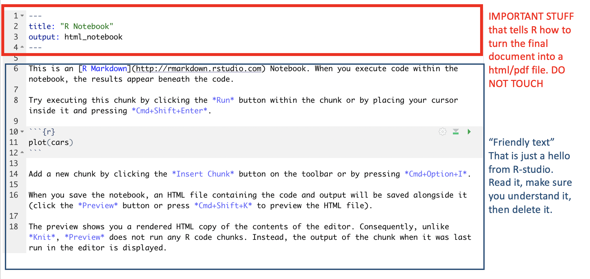

--- 
title: "STAT-462 Lab book"
author: "Helen Greatrex"
date: "`r Sys.Date()`"
site: bookdown::bookdown_site
documentclass: book
bibliography: [book.bib, packages.bib]
biblio-style: apalike
link-citations: yes
description: "Lab Book for STAT-462 2021"
---

# Tutorials

```{r, echo=FALSE,message=FALSE,warning=FALSE}

library("tidyverse") # Lots of data processing commands
library("knitr")     # Helps make good output files
library("rmarkdown") # Helps make good output files
library("lattice")   # Makes nice plots
library("RColorBrewer") # Makes nice color-scales
library("ISLR")      # contains a credit dataset
library("yarrr")     # contains a toy dataset about pirates
library("skimr")     # Summary statistics
library("Stat2Data") # Regression specific commands
library("olsrr")     # Regression specific commands
library("nortest")   # Regression specific commands
library("lmtest")    # Regression specific commands
library("IMTest")    # Regression specific commands 
library("MASS")      # Regression specific commands
#library("moderndive")# Regression specific commands
library("corrplot")  # correlation plots
library("car")       # this one sometimes has problems, don't panic if you get errors
library("ggpubr")    # QQplots
```

## Tutorial 1A: Installing R and R-studio

In this class, we would like you to download and install BOTH R and R-Studio onto your own computers.  You should have already completed this step for Homework 1.  If you have not, see instructions here: https://psu.instructure.com/courses/2115020/assignments/12682456 

FOR WINDOWS USERS.  Sometimes R asks you to download something called RTools.  You can do so here: https://cran.r-project.org/bin/windows/Rtools/  Follow the instructions closely and ask if you need support.


### Open R-studio

```{r, rrstudiot, echo=FALSE, fig.cap = "Icons of the R program and R-studio"}
knitr::include_graphics('images/Fig_01_01RRStudio.png')
```

**Open R-studio** (NOT R!).  You should be greeted by three panels:

 - The interactive R console (entire left)
 - Environment/History (tabbed in upper right)
 - Files/Plots/Packages/Help/Viewer (tabbed in lower right)

If you click on the View/Panes/Pane Layout menu item, you can move these quadrants around.  I tend to like the console to be top left and scripts to be top right, with the plots and environment on the bottom - but this is totally personal choice. 
 
```{r, basicStudiot, echo=FALSE, fig.cap = "The basic R-studio screen when you log on"}
knitr::include_graphics('images/Fig_01_02RStudio.png')
```

If you wish to learn more about what these windows do, have a look at this resource, from the Pirates Guide to R: https://bookdown.org/ndphillips/YaRrr/the-four-rstudio-windows.html

**If you have used R before, you might see that there are variables and plots etc already loaded**.  It is always good to clear these before you start a new analysis.  To do this, click the little broom symbol in your environment tab.

### Change a few settings

R-studio wants to be helpful and will try to re-load exactly where you were in a project when you log back in.  This can get really confusing, so we are going to turn this off.

ON A MAC: Click on the R-studio menu button on the top left of the screen, then click Preferences. 

ON A PC: Click on Tools-> Global Options -> Preferences

Now:

 - UNCLICK "Restore most recently opened project at startup"
 - Set "Save workspace to .RData on" exit to Never

## Tutorial 1B: Creating and loading R projects

### What are projects?

[](https://www.linkedin.com/learning/learning-the-r-tidyverse/why-should-you-use-projects-in-rstudio?u=76811570 "Why use R Projects")

One of the most useful new features in RStudio are R-Projects.  We are going to use R-projects to store our lab data in.  An R project is a place to store all your commands, data and output in the same place.  

Before R projects, we had to worry about where on your computer your data was saved in.  Now, we can force R-Studio to immediately look inside your lab folder - making life much easier. 

Equally, projects allow you to have multiple versions of R-studio open.  This is  useful because say you have Lab-2 open, but want to re-open Lab-1 to check some code, clicking the "Lab 1 project file" will load a whole new version of R with Lab 1 ready to edit.  

It is ***really*** important that you stay organized in this course, for example making sure you know where you put your data and your labs. 

**To encourage this, choose a place that makes sense on your computer, create a folder called STAT-462. can either do this outside R studio in your file explorer, or inside the "Files tab" in R studio.  You should store all your 462 labs inside this folder**

Now we will create our first project (also see the pic):  

 - open R-Studio and click `New Project`, 
 - then click "new directory" 
 - then "new project". 
 - Name your project Lab 1, then browse to your newly created STAT-462 folder and press open.
 - Press OK and your project is created.
    + You will also see that a new sub-folder has been created in your STAT-462 folder called Lab 1
    + Inside that is your Project file. (with a .Rproj extension)
 
```{r, projectt, echo=FALSE, fig.cap = "Instructions to create an R project"}
knitr::include_graphics('images/Fig_01_04Project.png')
```

Your output should look something like this:

```{r,finaloutt, echo=FALSE, fig.cap = "What you should see"}
knitr::include_graphics('images/Fig_01_05FinalOutput.png')
```

Equally, R should now be "looking" inside your Lab 1 folder, making it easier to find your data and output your results.  Try typing this into the console (INCLUDING THE EMPTY PARANTHESES/BRACKETS) and see if it prints out the location of Lab 1 on your computer. If not, talk to an instructor.

```{r, eval=FALSE}
getwd()
```
 
In the future, every time you want to work on Lab 1, rather than open R-studio directly, double click the R project file inside Lab 1 and you will get back to your work.
 
##### If you're having issues at this point or haven't managed to get to this step, STOP!  Ask an instructor for help. {-}

Now you have opened your project, take a screenshot of your R-studio page. It should look like the figure above, e.g. with at least R version 4.0.3, with the Lab 1 project and the project stored in your STAT-462 folder.

 - To take a screenshot on a mac, press Command-3.  The screenshot will appear on your desktop
 - To take a screenshot on a PC, press Alt + PrtScn  

Rename the screenshot to your "username_Lab1_Fig1"(for example for me it will be hlg5155_Lab1_Fig1), then place it in your Lab 1 sub-folder inside STAT-462.  This folder was created when you made the project.

You will need this later, so don't skip this step.


## Tutorial 1C: R coding basics

[](https://youtu.be/SWxoJqTqo08?t=41 "R basics")

So now we FINALLY get to do some R-coding.  First things first, first watch the 5 min video above for some pointers.  Will will also go through this below:

#### Using R as a calculator

Remember that the aim of R is to type in commands to get your computer to analyse data.   The console (see Figure \@ref(fig:basicStudio)) is a space where you can type in those commands and it will directly print out the answer. You're essentially talking to the computer.  

The little ">" symbol in the console means that the computer is waiting for your command.

Let's start by the simplest command possible.  Try typing each of the following commands into your R console and pressing Enter as you work through this.

```{r}
1+1
```

Note that spacing does not matter: `1+1` will generate the same answer as ` 1      +       1 `. 

When using R as a calculator, the order of operations is the same as you would have learned back in school, so use brackets to force a different order.  For example, 

```{r}
3 + 5 * 2
```

will give a different result to 

```{r}
(3 + 5) * 2
```

#### Adding text

Now for text. Can you say hello world?

```{r, projectoutt, echo=FALSE, fig.cap = "Your screen after running the project"}
knitr::include_graphics('images/Fig_01_06HelloWorld.png')
```
Nope, there is an error!  To make R understand text, it is important to use quote marks.  

```{r}
print("Hello World")
```

#### Comparisons

We can also do comparisons in R - using the special symbols TRUE or FALSE (no quote marks, they are special). 

Here we are asking R whether 1 is equal to 1.

```{r}
# note two equals signs is read as "is equal to"
1 == 1  
```

We could also have used

 - `!=` "Not equal to"
 - `<` "Less than"
 - `<=` "Less than or equal to`
 - `>` "Greater than"
 - `>=` "Greater than or equal to"


#### What if I press Enter too soon? {-}

If you type in an incomplete command, R will wait for you to complete it.  For example, if you type
`1 +` and press enter, R will know that you need to complete the command  So it will move onto the next line but the `>` will have changed into a `+`, which means its waiting for you to complete the command.  
  
**If you want to cancel a command you can simply hit the "Esc" key or press the little stop symbol and R studio will reset.**

Pressing escape isn’t only useful for killing incomplete commands: you can also use it to tell R to stop running code (for example if it’s taking much longer than you expect), or to get rid of the code you’re currently writing.


### Variables and assignment

It's great to be able to do maths easily on the screen, but really we want to be able to save our results, or load in data so we can run more complex commands.   In R, we can give our data a name e.g. we save our data as a variable.  So then, instead of typing the whole command, we can simply type the variable's name and R will recall the answer.

The symbol to store data into a variable is using the assignment arrow `<-`, which is made up of the left arrow and a dash.  You can also use the equals sign, but it can cause complications later on.  Try typing this command into the console:

```{r}
x <- 1/50
```

Notice that pressing enter did not print a value onto your screen as it did earlier. Instead, we stored it for later in something called a variable, with the name 'x'. 

So our variable `x` is now associated with the value 0.02, or 1/50.  You can print a variable on screen by typing its name, no quotes, or by using the print command.  Try printing out your variable.  

```{r}
x

# or

print(x)
```

Look for the Environment tab in one of the panes of RStudio, and you will see that 'x' and its value have appeared. This 'x' variable can be used in place of a number in any calculation that expects a number. Try typing

```{r}
log(x)
```

Notice also that variables can be reassigned:

```{r}
x <- 100
print(x)
```

x used to contain the value 0.025 and and now it has the value 100.

*Note, the letter x isn't special in any way, it's just a variable name. You can replace it with any word you like as long as it contains no spaces and doesn't begin with a number*.  Different people use different conventions for long variable names, these include

 - periods.between.words.1
 - underscores_between_words
 - camelCaseToSeparateWords

What you use is up to you, but be consistent.  

Finally, R IS CASE SENSITIVE.  X and x are different variables!

```{r}
h <- 1
H <- 2

ans <- h+H
print(ans)
```

##### Combining variables {-}

As I showed above, you can now use multiple variables together in more complex commands. For example, try these commands:

```{r}
#Take the variable x, add 1 then save it to a new variable called y
y <- x + 1 
# print the multiple of 2yx onto the screen
y
```

Now you can see that there are two variables in your environment tab, x and y.  Where y is the sum of the contents of x plus 1. 

The way R works is that first it looks for the commands on the right of the arrow.  It runs all of them, calculates the result, then saves that result with the name on the left of the arrow.  **It does not save the command itself, just the answer.**  For example, in this case, R has no idea that y was created using a sum, it just knows that it is equal to the number 3.

You can even use this to change your original variable .  Try typing the code below in a few times into the console and see what happens.

**A short cut to do this is to type the commands the first time, then use the up-arrow on your keyboard to cycle back through previous commands you have typed**

```{r}
x <- x + 1 # notice how RStudio updates its description of x in the environment tab
x          # print the contents of "x" onto the screen
```

Our variables don't have to be numbers. They could refer to tables of data, or a spatial map, or any other complex thing.  We will cover this more in future labs.

### Functions

A command is simply an action you can take - like pressing the square root button on a calculator, followed by the number you wish to take the square root of.  A command is *always* followed by parentheses ( ), inside which you put your arguments. 

The power of R lies in its many thousands of these built in commands, or *functions*. In fact, we have already come across one - the print command.  Some more examples include:

 - `plot(x=1:10,y=1:10)` 
    + This will plot the numbers 1 to 10 against 1 to 10
 - `x <- nchar("hello")` 
    + This will count the number of letters in the word "hello" (e.g. 5), then save it as a variable called x

Watch this short video to learn three important facts about functions:

[](http://vimeo.com/220490105 "R functions")

One example of a function is `file.choose()` (not how I put the parentheses in this lab book so you can see it is a command).  This command will let you interactively select a file and print the address out onto the screen. 

Try each of these out in your console for the file.choose() command, leaving the parentheses blank. 

```{r, eval=FALSE}
# Typing this into the console will print out the underlying code
file.choose 

# Typing it WITH parentheses will run the command.  
file.choose()

# Typing a ? in front will open the help file for that command
?file.choose
```

Sometimes we need to give the command some additional information.  Anything we wish to tell the command should be included inside the inside the parentheses (separated by commas).  The command will literally only know about the stuff inside the parentheses.

```{r}
sin(1) # trigonometry functions.  Apply the sine function to the number 1. 
```

```{r}
log(10) # natural logarithm.  Take the natural logarithm of the number 10. 
```

This following command will plot the number 1 to 10 against the numbers 12 to 20, along with some axis labels.  When you run this, the plot will show up in the plots tab.  

```{r}
# plot the numbers 1 to 10 against the numbers 11 to 20
plot(1:10,11:20,col="dark blue", xlab="x values",ylab="STAT-462 is the best") 
```


If you are feeling lost, https://swcarpentry.github.io/r-novice-gapminder/01-rstudio-intro/
is a really good website which goes over a lot of this in more detail.  A lot of this is based on their work.


## Tutorial 1D: Packages

There are now several million commands/functions available for you to use in R.  To make sure your computer doesn't get overwhelmed, it doesn't load all of these at once. In fact many need to be downloaded from the internet. 

So we have 

 - R: The programming language itself
 - Functions: Specific commands or actions written in the R language
 - Packages: Commands are grouped into bundles/apps called packages, which we download from the internet and load every time we need them.

A close analogy is your phone.  There are millions of apps available from banking, to social media to camera filters.  You don't have every app in the world installed on your phone - and you don't have every app you *do* download running at the same time.  

This is the same for R:

 - You *download and install* packages from the internet that you might need. This can be done by clicking the install button in the Packages tab.  Or you can use the `install.packages()` command. You only ever need to do this once.
 - To actually run the commands in the package you need to load/run them - just in the way you tap an app to start it. This can be done using the `library()` command.
 
Now we are going to download some packages from the internet and install them.  You must be connected to the internet to make this happen!  In the console, type the following commands, or click the "Install" button in the packages tab (next to plots) and find the package name. If it asks if you want to install dependencies, say yes.

If R gives you warnings about rtools, ignore them or follow the instructions at the top to install R-Tools.

```{r, eval=FALSE, echo=TRUE}

# COPY/PASTE THESE INTO YOUR CONSOLE AND LET THEM RUN. 
#(These are hopefully all the packages for the course, so it's a one off download)

install.packages("tidyverse") # Lots of data processing commands
install.packages("knitr")     # Helps make good output files
install.packages("rmarkdown") # Helps make good output files
install.packages("lattice")   # Makes nice plots
install.packages("RColorBrewer") # Makes nice color-scales
install.packages("ISLR")      # contains a credit dataset
install.packages("yarrr")     # contains a toy dataset about pirates
install.packages("skimr")     # Summary statistics
install.packages("Stat2Data") # Regression specific commands
install.packages("olsrr")     # Regression specific commands
install.packages("nortest")   # Regression specific commands
install.packages("lmtest")    # Regression specific commands
install.packages("IMTest")    # Regression specific commands 
install.packages("MASS")      # Regression specific commands
install.packages("moderndive")# Regression specific commands
install.packages("corrplot")  # correlation plots
install.packages("ggpubr")    # Nice regression plots
install.packages("car")       # this one sometimes has problems, don't panic if you get errors

```

You will see a load of red text appear in the console as it tells you its very detailed status of how it's downloading and installing.  Don't panic!  It might also take several minutes to do this, longer on a bad internet connection. We are doing this as a one off at the start of the course.

When you have run all the commands and waited until they have finished running (remember, when it is done, you should see the little ">" symbol in the console waiting for your next command), we want to check if they have installed successfully onto your computer.

To do this we are going to load them using the library command:

```{r, eval=FALSE, echo=TRUE}

library("tidyverse") # Lots of data processing commands
library("knitr")     # Helps make good output files
library("rmarkdown") # Helps make good output files
library("lattice")   # Makes nice plots
library("RColorBrewer") # Makes nice color-scales
library("ISLR")      # contains a credit dataset
library("yarrr")     # contains a toy dataset about pirates
library("skimr")     # Summary statistics
library("Stat2Data") # Regression specific commands
library("olsrr")     # Regression specific commands
library("nortest")   # Regression specific commands
library("lmtest")    # Regression specific commands
library("IMTest")    # Regression specific commands 
library("MASS")      # Regression specific commands
library("moderndive")# Regression specific commands
library("corrplot")  # correlation plots
library("ggpubr")    # Nice regression plots
library("car")       # this one sometimes has problems, don't panic if you get errors

```

If you have managed to install them successfully, often nothing happens - this is great!  It means it loaded the package without errors.

Sometimes, it will tell you friendly messages.  For example, this is what shows up when you install the tidyverse package.  It is telling you the sub-packages that it downloaded and also that some commands, like filter - now have a different meaning.  E.g. originally the filter command did one thing, but now the tidyverse package has made filter do something else.

```{r, tidyverset, echo=FALSE, fig.cap = "Tidyverse install messages"}
knitr::include_graphics('images/Fig_1_15Tidyverse.png')
```

**To find out if what you are seeing is a friendly message or an error, run the command again.  If you run it a second time and there is no error then nothing should happen.**

!  **IMPORTANT**  If you see some red errors here after multiple attempts running the commands, we will have to fix what your computer is doing together.  If you see errors, then take a screenshot of the full page and talk to a TA or Dr Greatrex, or post on the Lab 1 discussion.  

Note - you don't need to submit anything for lab challenge 2 - it's here to make the rest of the semester run smoothly. Your only action is to reach out if there are errors.

## Tutorial 1E: R Markdown basics

### What is R-markdown?

So far, we've been typing commands into the console, but these will all be lost once you close R. Equally, it's hard to remember or reproduce the analysis you have done . So we will now move onto writing code commands that you can save and submit.

There are several types of document that you can create and save in R-Studio.

 - A basic script (the filetype is .r).  This is simply just a blank document where you can save code commands.  When you "run" the commands in the script, R simply copy/pastes the commands over to the console.
 
 - An R-Notebook or R-Markdown document (the filetype is .Rmd).  These are documents you can use to write a report with normal text/pictures, but and also include both your R code and output. You can turn these into reports, websites, blogs, presentations or applications. For example these instructions are created using a markdown document.    
 
In this course we are going to focus on the R-Markdown format and you are going to submit your labs as html files.  

### Creating a markdown document

Time to make your own. Go to the File menu on the top left, then click New File - R-Markdown. It will ask you to name and save your file.  Call it STAT-462 Lab 1.

```{r, startmarkdownt, echo=FALSE, fig.cap = "You should see TWO new files appear in your lab 1 folder"}
knitr::include_graphics('images/Fig_01_08_Markdown.png')
```

A file should appear on your screen - your first markdown script. Essentially, we have some space for text, some space for code, and a space at the top of the file where we can add information about themes/styles etc.  Each file contains some friendly text to explain what is going on, which I have annotated here.


```{r, markdownt, echo=FALSE, fig.cap = "You should see TWO new files appear in your lab 1 folder"}
knitr::include_graphics('images/Fig_1_09Markdown.png')
```

Code chunks are the grey areas and are essentially "mini consoles". If you click on the little right triangle arrow at the top-right of the code chunk, you can run the plot command, and a plot will appear, running the code.  

Note, it no longer runs in the console. You can still copy things into the console, by clicking on the line you want to run and pressing Ctrl-Enter / command-Enter.

Let's try this.  On line 11, delete `plot(cars)` and type `1+1`.  Now press the green arrow and the answer should appear directly under your code chunk.  

Now click at the end of the script, around line 20 and press the green insert button (top right in the script menu icons).  Insert a new R code chunk.  Inside, type `1+2` and run it.  So you can see that you can have text/pictures/videos etc, and code chunks interspersed throughout it.


*Now press the "knit" button (right next to the save button)*.  

It will first ask you to save. Save it as STAT462_Lab1_PSU.ID   e.g. STAT462_Lab1_hlg5155. Then, this should make a new file pop-up, a html pretty version of your code and output.   If you go to your lab 1 folder, you will see that this has appeared next to your .Rmd file.


### "Friendly text" {#friend}

Much of what you see on your screen when you open a notebook document is simply a friendly introduction to RStudio.

So your notebook file is essentially a Word document with the ability to add in "mini R-consoles", AKA your code chunks.  Imagine every time you opened a new word document, it included some "friendly text" (*"hi, this is a word document, this is how you do bold text, this is how you save"*). This is great the first time you ever use Word, but kind of a pain after that.   

RStudio actually does this.  Every time you open a notebook file, you actually *do* get this friendly text, explaining how to use a notebook file.  Read it, make sure you understand what it is telling you, then delete all of it. So delete from line 6 to the end.  The stuff left over is your YAML code which tells R how to create the final html file. DON'T TOUCH THAT.

```{r, friendlyt, echo=FALSE, fig.cap = "You should see TWO new files appear in your lab 1 folder"}

```


## Tutorial 2A: Getting help in R

There are going to be many occasions when either you are not sure what to do in R or something is not working. Here are some of the places I get help:
  
### Help on a specific command

You can type `?function_name` into the console where [name] is the CASE SENSITIVE name of the command.  For example, you can find help on the boxplot command by typing `?boxplot` or `help(boxplot)`.  

 - The top part of each help file will show you a list of the parameters that you can use to modify the command. For example in the boxplot help file you can see that the col parameter can be used to change the boxplot colour.

 - The middle part of the help file contains details about the command for example the background or further reading

 - The last part of the help file contains worked examples that you can literally copy/paste into the console too see how they work.
 
If you're *sure* you typed the name correct but it can't find the help-file, then you probably first need to load the package containing the command.  For example `?ggqqplot` will not work before you use `library("ggpubr")` to load the `ggpubr` package. 
 
 
### Finding a command name

Let's say that you want to run a Wilks Shapiro test but you cannot remember what the command is called. In the console try typing `??"search_text"` or `help.search("search_text")` e.g. try `??"shapiro"` or `help.search("shapiro")`.

Note, there are now quote marks around the text you are searching for. To seek help on special operators, use quotes or back-ticks e.g. `?"<-"`.

`help.search("shapiro")` will search through every R help file on your computer that includes the word "shapiro".  

```{r, helpfilet, echo=FALSE}
knitr::include_graphics('images/Fig_02_01HelpFile.png')
```

You can see that there are a three commands I can choose from (I might have more than you here).  For each command you can see the package containing the command, followed by :: then the command name.  Clicking on it brings up the help file.

Remember to actually use any command in R, you first need to load the relevant package. For example,  if I wanted to use the nortest version of sf.test, then I would first need to include the command `library(nortest)` in order for it to be available.

### Asking the internet: 

```{r, xkcdt, echo=FALSE,fig.cap="This may be a cartoon but it's genuinely how I debug my code!"}
knitr::include_graphics('images/Fig_02_02XKCD.png')
```

If your code isn't working.  Google is a great tool and you have full permission to search google to debug your code - I guarantee someone will have seen your error code before.  I often literally copy/paste an error code into google and see what comes up.  Or search google for things like "how to add an image R markdown".

One good place to search is Stack Overflow.  To go directly to R-related topics, visit http://stackoverflow.com/questions/tagged/r. Here's how to ask a good question: https://stackoverflow.com/help/how-to-ask 

When asking for help, typing the command `sessionInfo()` into the console will print out the version of R and the packages you have loaded. This can be useful for debugging any issues.

You also always have lab sessions to ask questions or the discussion boards at any time.

### General help & cheatsheets 

Within R, try running `help.start()` in the console (remember to include the empty parentheses or R won't realise it's a command).  This brings up all the manuals R has available on your computer.  An introduction to R is particularly useful. Click on it and have a look around.

There are also some really good cheat-sheets out there:

  - MARKDOWN cheat-sheet: go to the help menu at the very top of your screen. Click `Markdown Quick Reference`.
  - Loads more cheatsheets: https://rstudio.com/resources/cheatsheets/
  - The R graph gallery https://www.r-graph-gallery.com/  contains code for many beautiful plots that you can make.
  - Googling the name of a package often leads to a website with nice tutorials. For example, I found this for the paletteer package https://emilhvitfeldt.github.io/paletteer/.
  - A nice markdown summary - https://ourcodingclub.github.io/tutorials/rmarkdown/ with answers to things like preview vs knit. 
 

## Tutorial 2B: Markdown formats

The aim of this tutorial is to make your markdown reports more professional and easy to read. In future weeks we will continue to expand this work so that by the end of the course, you can make highly professional interactive reports.  For example, [click here](https://rmarkdown.rstudio.com/formats.html) for all the types of document you could easily turn your report into. 


### Editing YAML code

This is the code at the top of your file (Figure 1.8 & 1.9).  It controls how your final output looks and which type of output it becomes.  When you create a markdown file, your code will look like one of these two options (one created using notebook and one markdown - either are fine)

```{r, yamlt, echo=FALSE,fig.cap="One created using a notebook and one using a markdown"}
knitr::include_graphics('images/Fig02_03YAMLCode.png')
```

No matter what you have, it is useful to change the YAML code so that it looks like this, but with your name & Lab 2.

Note, if you copy/paste this and it doesn't work, sometimes the quote marks copy weirdly from the internet - try deleting and retyping the quotes.  

```{r,eval=FALSE}
---
title: "STAT-462: Lab 2"
author: "Helen Greatrex"
date: "`r Sys.Date()`"
output:
  html_document:
    toc: true
    toc_float: yes
    number_sections: yes
    theme: lumen
    df_print: paged
  html_notebook:
    toc: true
    toc_float: yes
    number_sections: yes
    theme: lumen    
---
```

Now, save your file, or click "preview" at the top of the script.  See if it works. 

There is a reasonable chance this won't work first time around, as editing the YAML code can be a pain.  It is very case and space sensitive.  For example, the spaces at the start of some lines are important and are created using the TAB KEY, not the space bar.  There is one TAB key before html_notebook (which is now on a new line). There are two TAB KEYS before toc, toc_float, number_sections and theme.

*Don't continue until you can make and view your html or nb.html file. If it doesn't work, ask for help before moving on*

The elements we just added are:

 - The title
 - The author
 - Today's date
 - A floating table of contents and numbered sections (this won't appear until you start typing section headings)
 - The document is now in the lumen theme. **You can choose other themes for markdown documents here.  https://www.datadreaming.org/post/r-markdown-theme-gallery/**

There are many more details about different options you can add here: https://rstudio.com/wp-content/uploads/2015/03/rmarkdown-reference.pdf

If you want to get really fancy, there is an interesting package to help you design YAML code here: https://education.rstudio.com/blog/2019/10/tools-for-teaching-yaml-with-ymlthis/


### Text formats

R-Markdown uses text formatting a bit like LateX rather than word where you format the text as you write.  First off - there are many cheat-sheets out there, but I particularly like this one https://www.markdownguide.org/basic-syntax/.  

One important way to make your R Markdown documents look more professional is to add in headings, sub-headings and text formats.  Today we will look at headings and bold/italic text.


```{r, formatst, echo=FALSE,fig.cap="A typical Rmd file (right) and its output (left) - note you need to click on the contents bar to expand it"}
knitr::include_graphics('images/Fig02_04Markdownformat.png')
```

First, go to the help menu at the very top of your screen (might be hidden) and click Markdown quick reference.  This will bring up a cheat-sheet.  

```{r, quickreft, echo=FALSE,fig.cap="The top menu might be hidden"}
knitr::include_graphics('images/Fig02_05markdownref.png')
```


**Paragraphs and white space - READ THIS:**

R is very sensitive to blank white lines.  Put them everywhere.  Put a blank line between paragraphs, before/after headings, before lists, before/after code chunks....  If your formatting isn't working well, chances are there isn't a blank line before or after it.

**Headings:**

*Inside* a code chunk, the # symbol allows you to write mini comments that help explain the command e.g. 

```{r,collapse=TRUE}
# calculate 1+1 and 2+2
1+1
2+2
```


*Outside* a code chunk, the # symbol makes a heading, AS LONG AS YOU HAVE A WHITE LINE ABOVE AND BELOW.  Have a look at the figure above for an example.  Including headings this way allows automatic section numbering and will allow the table of contents to automatically be created.  In the script itself the headings won't show up - you will only see them when you press knit.

**Bold and italic:**

Putting stars or _ around your text will make it bold or italic (or both).  Again have a look at the figure above and the cheat-sheet. Interestingly (and annoyingly), there is no simple way to underline text. In the script itself the text formatting won't show up, you will only see them when you press knit.


## Tutorial 2C: Selecting & summarising data 

### Data.frame introduction

Most of the data we will look at is in "data.frame" format.  This is a table, just like an excel spreadsheet, with one row for each observation and one column for each variable. Each column has a column name.

Next week we will work on loading our own data into R.  This week we will focus on in-built R datasets. 

Let's choose one now. I'm going to work with the pirates dataset from the `yarrr` package. We can choose the data here.

```{r, echo=FALSE,message=FALSE,warning=FALSE}
dataset <- pirates
```

```{r, eval=FALSE, echo=TRUE}
library(yarrr)
library(tidyverse)
?pirates
dataset <- pirates
```

To have a look at the data there are many options. You can either:

 - click on its name in the environment tab
 - Type its name into the console or into a code chunk (e.g. for our table, type `dataset` into the console or a code chunk)
 - Run the command `View(variable_name)` (View is a command from the tidyverse package)
 - Run the command `print(variable_name)` 
 - Run the command `head(variable_name)` to see the first 6 lines or so (good for quick checks)
 
 For example
 
```{r}
# Note, there are more columns to the right, use the arrow to see
head(dataset)
```

To see what the column names are, you can use the `names(dataset)` command

```{r}
names(dataset)
```

Or look at the summary

```{r}
summary(dataset) 
# You can also use the skimr package and skim command here
# skim(pirates)
```

To see how many columns and rows there are, you can use the `nrow()` and `ncol()` commands

```{r}
# there are 1000
nrow(dataset)
ncol(dataset)
```


### Selecting individual values

You can select rows and columns using SQUARE brackets and [rows,columns].  For example

```{r}
#select row 2 and columns 4,5 & 6 (that's what the : does, counts from 4 to 6)
dataset[2 , 4:6]

#select rows 1,3 and 5 - plus the height and eyepatch columns
# the c() command lets you choose whatever values you want and sticks (concatenates) them together
dataset[c(1,3,5),c("height","eyepatch")]

# Leave the right side empty for all the columns
# e.g this prints all columns of rows 2,3 and 4
dataset[2:4, ]

# or all the values in a column - I leave the left side blank to select all rows
# Here I assigned the answer to a new variable called b, That's why it didn't print out.
b <- dataset[ ,c("college","tattoos")]


```


### Selecting a single column 

The easiest way to do this is with the $ symbol.  LEARN THIS!  It is incredibly useful

For example, to view the age column of the pirates table, I would type `pirates$age` - so to make a histogram of the pirates ages, I would type

```{r}
hist(dataset$age,xlab="Pirates ages")
```

### Selecting mulitple columns

Sometimes your table is very large and you might only care about a few of the variables.  So we could make a new table where we only keep the columns we care about.  For example, as described in the R cheatsheet

```{r, select, echo=FALSE,fig.cap="picture from the tidyverse cheatsheet"}
knitr::include_graphics('images/Fig02_06SelectColumns.png')
```

Inside the tidyverse packages, there are some easy functions for selecting columns or rows.  To choose specific columns, we can use the `dplyr::select()` function from the tidyverse package or square brackets. Whatever makes you more comfortable.

Let's select only the "age","height","sex","weight","favorite.pirate" and "beard.length" columns:

```{r}
# print the column names, so its easier to write the command
names(dataset)

# The "traditional R way"
newdata <- dataset[,c("age","height","sex","weight","favorite.pirate",
                      "beard.length")]

# The "tidyverse way"
# Note, i'm telling it that I want select from the dplyr package because 
#        R wanted to choose a different "select" function
identicalnewdata <- dplyr::select(as_tibble(dataset),c(age,height,weight,
                                                       favorite.pirate,beard.length))

# have a look at what we did
head(newdata)

```

### Selecting subsets of rows/observations

Very commonly, we want to select only *some* rows in our table.  For example, let's say I want to look at the distribution of men's beard lengths.  This  means that I only want to select the men in the pirates dataset.  

Again there are two ways of doing this:

```{r}
# e.g. select rows have the column sex set equal to male

# The "traditional R way". You can use either == or %in% for your selection
malepirates <- newdata[which(newdata$sex %in% "male"),]
malepirates <- newdata[which(newdata$sex  ==  "male"),]

# The "tidyverse way". 
malepirates <- dplyr::filter(newdata, sex == "male")

# have a look at what we did
head(malepirates)

```

You can also use other symbols to select data

 - `>=` greater than or equal to
 - `>`  greater than
 - `==` equal to
 - `!=` NOT equal to
 - `<`  less than
 - `<=` less than or equal to

```{r, collapse=TRUE}
# What is the average weight of pirates who are over 150cm tall?
tallpirates <- dplyr::filter(dataset, height > 180)
mean(tallpirates$weight)
```


Or you could use multiple conditions using the & symbol or | symbol

```{r,collapse=TRUE}
# What is the average weight of MALE pirates who are over 150cm tall?
tall.male.pirates <- dplyr::filter(dataset, height > 180 & sex == "male")
mean(tall.male.pirates$weight)
```

```{r,collapse=TRUE}
# What is the maximum number of tattoos on tall pirates who have at least 1 parrot OR an eyepatch
tall.parrot.eye <- dplyr::filter(dataset, height > 180 & (parrots >= 1 |eyepatch == 1 ))
max(tall.parrot.eye$tattoos)
```


### Looking at summary tables

We often want to see summary statistics of our data. We covered the `summary` command last week and above.  But what about categorical data?  Just how many pirates liked Monsters Inc.?   We can look at this using the `table()` command.

This counts the number of rows containing each category.  For example, we can see here that 50 pirates out of the 1000 chose Monsters Inc as their favourite film

```{r}
table(dataset$fav.pixar)
```

We can also go beyond this. For example, let's break it up by gender - where we can see that 2 non-binary pirates liked the film.

```{r}
table(dataset$fav.pixar,dataset$sex )
```

Going one step further, we can see that both of our two non-binary pirates who chose Monsters Inc., both use cutlasses.

```{r}
table(dataset$fav.pixar,dataset$sex,dataset$sword.type)
```

### Basic plots (one variable)

In general, there are two very good websites for making professional graphics in R. I regularly browse both of them along with stack overflow to generate plots to be proud of, or to ask questions like "how do I change the axis size?".

 - Stat-Methods
    - https://www.statmethods.net/graphs/index.html 
    - https://www.statmethods.net/advgraphs/index.html 
 - R Graph gallery
    - https://www.r-graph-gallery.com/index.html


#### Histograms {-}

We discussed the basic histogram command last week: `hist(variable)`.  For example `hist(malepirates$age)` makes a histogram of the age column in the data.frame we created earlier on male pirates.

 - To make it look prettier, have a look at ?hist - or this article: https://www.statmethods.net/graphs/density.html
 - Or.. you can make any one of these histograms using the ggplot package (https://www.r-graph-gallery.com/histogram.html)


#### Boxplots {-}

We discussed the basic boxplot command last week: `boxplot(variable)`.  For example `boxplot(malepirates$age)` makes a boxplot of the age column in the data.frame we created earlier on male pirates.  To be more fancy:

```{r,eval=FALSE}
boxplot(age~sex,         
        data=dataset,                       
        xlab="Gender",ylab="Age") 
        #names=c("Male","Female","Non-binary"))
```

 - To make it look prettier, have a look at ?boxplot - or this article: https://www.statmethods.net/graphs/boxplot.html
 - Or.. you can make any one of these boxplots (https://www.r-graph-gallery.com/boxplot.html)

#### QQ-Norm plots {-}

We discussed the basic qqnorm command last week: `qqplot(variable)`.  For example `qqplot(malepirates$age)` makes a qq-norm plot of the age column in the data.frame we created earlier on male pirates.  There is a nicer version inside the ggpubr package.

```{r, eval=FALSE}
library(ggpubr)
ggqqplot(malepirates$age,col="blue")
```


## Tutorial 2D: Distributions and tests

We have talked about several distributions and tests so far in the lab.  To see the help files for most of them, see `?Distributions`

### Normal distribution

To see the help file for all these:
```{r,eval=FALSE}
?Normal
```

To generate a random sample from a normal distribution: 
```{r}
sample.normal <- rnorm(n=100,mean=4,sd=2)
```

To calculate a z score from your sample/population, you can use R as a calculator. 

To calculate the probability of greater/lesser than a value in a given normal distribution (e.g. you can use this as an interactive table)
```{r}
# probability of less than 1.7 in a normal distribution of N(4,2^2)
pnorm(1.7,mean=4,sd=2,lower.tail = TRUE)

# probability of greater than 1.8 in a normal distribution of N(4,2^2)
1 - pnorm(1,mean=4,sd=2,lower.tail = TRUE)
# or
pnorm(1,mean=4,sd=2,lower.tail = FALSE)
```

To calculate the value for a given probability
```{r}
# what value is less than 60% of the data?
qnorm(0.6,mean=4,sd=2,lower.tail = TRUE)

# what value is greater than 80% of the data?
qnorm(0.8,mean=4,sd=2,lower.tail = FALSE)
```


### Student's t-distribution

To see the help file for all these:
```{r,eval=FALSE}
?TDist
```

To calculate a t-statistic from your sample/population, you can use R as a calculator.  To calculate the probability of greater/lesser than a value in a given t-distribution (e.f. you can use this as an interactive t-table)

```{r}
# probability of seeing less than 1.7 in a  t-distribution 
# with 20 degrees of freedom
pt(1.55,df=20,lower.tail = TRUE)

```

To calculate the value for a given probability
```{r}
# what value is greater than 90% of the data in a t-distribution with df=25
qt(0.9,df=25,lower.tail = TRUE)
```

To conduct a full t-test on some data:
```{r}
# Conduct a one sided t-test where we think that H0: mu(age)=30 on our pirates data (e.g. H1: mu(age) != 30 )
t.test(dataset$age,mu=30,alternative="two.sided")
```

or see the detailed tutorial here: http://www.sthda.com/english/wiki/one-sample-t-test-in-r for one-sample

and here for comparing two samples: http://www.sthda.com/english/wiki/unpaired-two-samples-t-test-in-r


### Wilks Shapiro test for normality

To test for normality: 

```{r}
# Conduct a W-S test for normality on the ages of pirates
shapiro.test(dataset$age)
```

## Tutorial 3A - Editing code chunks

R code chunks are really useful as you can completely control the output seen in your final report.  To edit these, we edit the bit INSIDE the curly brackets at the top of the code chunk.  

For example,

```{r, chunkoptions, echo=FALSE,fig.cap="Replace option1, option2 etc with the things you want the chunk to do"}
knitr::include_graphics('images/Fig03_02ChunkOptions.png')
```

There are a huge number of options available as described here: https://bookdown.org/yihui/rmarkdown-cookbook/chunk-options.html

For now, we will focus on some basics:

**Q: How can I stop all the friendly "loading library" text coming up when I load a library?**

Ans:  we include message=FALSE and warnings=FALSE at the top of the code chunk e.g.

```{r,message=FALSE,warnings=FALSE}
library("yarrr")
```

**Q: How can I add a figure caption?**

Ans. Using the fig.cap argument e.g.  ```{r,fig.cap="my caption"}

**Q: How can I make the code invisible?**

Ans: Unless specifically asked, I don't recommend doing this in STAT-462 because we are grading you on your ability to code!  But it is a useful skill.  Here is how to do it for a figure insert (the most common request).  I also gave my code chunk a name (chipmunk.pic), so that I can refer to it later in the text.

For example, this code:

```{r, chipcode, echo=FALSE}
knitr::include_graphics('images/Fig03_03Chipnunkcode.png')
```

Will lead to this output (the caption only shows up when you knit)

```{r, chipmunk.pic, echo=FALSE,fig.cap="Summer!"}

```


## Tutorial 3B - Regression Models

Now we will fit our first regression model.  The command to do this is `lm()` e.g. linear model.

```{r,eval=FALSE}
output <- lm(y_column ~ x_column,data=tablename)
output
```

NOTE, THE WEIRD ~ SYMBOL. This means "depends on" and it's how we tell R what the response variable is.  E.g. y depends on x, or y=mx+c.  

For example for the starwars data, it would be

```{r}
# response = mass, predictor = height
star.lm <- lm(mass ~ height,data=starwars)
star.lm
```

You can also look at the summary by looking at the summary command:

```{r}
summary(star.lm)
```

In both cases, we have an estimate of the intercept (0.6386) and of the gradient (-13.8103).  We will discuss the other values in later labs/lectures.

Now let's see how to add the regression line to our scatterplot.  We can do this using `abline(REGRESSION_VARIABLE)`, where regression_variable is the name of the variable you saved the output of lm to.  For example.

```{r}
plot(starwars$height,starwars$mass)
abline(star.lm)
```


#### Fancy regression output

If you want a different way of seeing the same output, you can use the `ols_regress()` command inside the `olsrr` package.  

```{r}
library(olsrr)
star.ols.lm <- ols_regress(mass ~ height,data=starwars)
star.ols.lm
```

The ols_regress command produces beautiful output, but sometimes it doesn't work well with other commands.  So I tend to run a lm command at the same time to have both available.

Sometimes, this command can produce a weird error:

```{r, olsrr.error, echo=FALSE,fig.cap="This is probably because you loaded the moderndive package"}
knitr::include_graphics('images/Fig03_05OLSRR.png')
```

This is probably because you loaded the moderndive package. They do not play nicely together. Save your work, restart R and **do not run any line that says library(moderndive)!**.